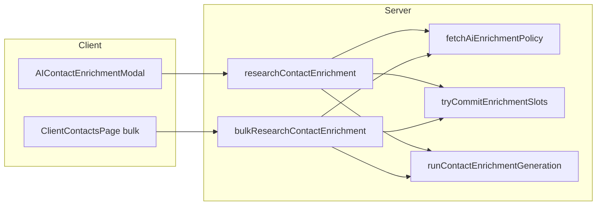

# AI Contact Enrichment — completion plan

## Current state (important)

The following already exist and align with the company feature:

- [`src/lib/validations/contact-enrichment.ts`](src/lib/validations/contact-enrichment.ts) — strict Zod AI schema, `emptyStringToNull`, `sanitizeContactEnrichmentOutput`, `bulkResearchContactEnrichmentInputSchema`, `CONTACT_ENRICHMENT_FIELD_KEYS` (`email`, `telefon`, `position`, `notes`).
- [`src/lib/actions/contact-enrichment.ts`](src/lib/actions/contact-enrichment.ts) — `researchContactEnrichment`, `bulkResearchContactEnrichment`, shared `fetchAiEnrichmentPolicy`, `tryCommitEnrichmentSlots` / `refundEnrichmentSlots`, and the same style of pipeline error codes as companies (`VERCEL_AI_GATEWAY_CREDITS_EXHAUSTED`, `XAI_GROK_QUOTA_EXHAUSTED`, `AI_ENRICHMENT_RATE_LIMIT:…`, etc.).
- [`src/lib/ai/company-enrichment-gateway.ts`](src/lib/ai/company-enrichment-gateway.ts) — `runContactEnrichmentGeneration` (Perplexity + two-phase structuring, Claude/Grok modes, BYOK options).
- [`src/lib/validations/contact-enrichment.test.ts`](src/lib/validations/contact-enrichment.test.ts) — basic schema/sanitizer coverage.

**No changes are required** to `ai-enrichment-policy.ts`, `enrichment-rate-limit.ts`, or Supabase types for this feature—the daily counter is already shared per user.

---

## 1. Exact files to create/edit and why

| Action | File | Why |
|--------|------|-----|
| **Create** | [`src/components/features/contacts/ai-enrichment/AIContactEnrichmentModal.tsx`](src/components/features/contacts/ai-enrichment/AIContactEnrichmentModal.tsx) | Review-only modal: same UX shell as [`AIEnrichmentModal.tsx`](src/components/features/companies/ai-enrichment/AIEnrichmentModal.tsx) (usage snapshot, Vercel credits line, progress, table, apply selected), but `researchContactEnrichment`, `Contact` + `ContactEnrichmentResult`, `CONTACT_ENRICHMENT_FIELD_KEYS`, and `CONTACT_NOT_FOUND` in error resolver. |
| **Edit** | [`src/app/(protected)/contacts/[id]/ContactDetailClient.tsx`](src/app/(protected)/contacts/[id]/ContactDetailClient.tsx) | Header “AI Enrich” control; `aiModalOpen` + optional `aiPrefill` / `onAiPrefillConsumed` pattern from [`CompanyDetailClient.tsx`](src/app/(protected)/companies/[id]/CompanyDetailClient.tsx); mount `AIContactEnrichmentModal`; optional Cmd/Ctrl+E shortcut for parity. **Replace** the large inline `EditContactForm` with shared [`ContactEditForm`](src/components/features/contacts/ContactEditForm.tsx) so one implementation gets AI + prefill (avoids duplicating the whole form). |
| **Edit** | [`src/components/features/contacts/ContactEditForm.tsx`](src/components/features/contacts/ContactEditForm.tsx) | Mirror company props: `onRequestAiEnrich?`, `aiPrefill?`, `onAiPrefillConsumed?`; top-right AI control (reuse [`AIEnrichButton`](src/components/features/companies/ai-enrichment/AIEnrichButton.tsx) with `useT("contacts")` keys **or** a thin contact-specific button using the same visuals); local `AIContactEnrichmentModal` only when `onRequestAiEnrich` is absent (same branch pattern as [`CompanyEditForm.tsx`](src/components/features/companies/CompanyEditForm.tsx)). `useEffect` merge on `aiPrefill.version` + `contact?.id`. **Hide** AI when `!contact` (create flow). |
| **Edit** | [`src/app/(protected)/contacts/ClientContactsPage.tsx`](src/app/(protected)/contacts/ClientContactsPage.tsx) | Own `rowSelection` / `setRowSelection`, `bulkAiEnrichPending`, and `handleBulkAiEnrich` calling `bulkResearchContactEnrichment` — copy the error branch pattern from [`ClientCompaniesPage.tsx`](src/app/(protected)/companies/ClientCompaniesPage.tsx) (~L320–356). Toolbar above table when selection non-empty (Sparkles + disabled while pending). |
| **Edit** | [`src/components/tables/ContactsTable.tsx`](src/components/tables/ContactsTable.tsx) | Controlled row selection: add `rowSelection` + `onRowSelectionChange` props (same contract as [`CompaniesTable.tsx`](src/components/tables/CompaniesTable.tsx)); remove internal `useState` for row selection when parent supplies state. |
| **Edit** | [`src/components/features/settings/AIEnrichmentSettingsCard.tsx`](src/components/features/settings/AIEnrichmentSettingsCard.tsx) | Only if copy cannot live in i18n alone (prefer **messages-only** change below). |
| **Edit** | [`src/messages/en.json`](src/messages/en.json), [`src/messages/de.json`](src/messages/de.json), [`src/messages/hr.json`](src/messages/hr.json) | New `contacts.aiEnrich.*` block (mirror `companies.aiEnrich` strings with contact-specific titles/descriptions/bulk strings). Update `settings.aiEnrichment.usageHint` in all three locales to state that **company and contact** enrichment share the same daily run pool. |

**Constraint note:** Your “only listed files” rule cannot cover i18n without touching `messages/*.json`. The minimal honest set includes those three JSON files plus the table/page/components above (gateway/actions/validation already exist).

---

## 2. How the contact schema reuses company infrastructure

- **Policy & rate limit:** Same [`fetchAiEnrichmentPolicy`](src/lib/services/ai-enrichment-policy.ts) and [`enrichment-rate-limit`](src/lib/ai/enrichment-rate-limit.ts) as companies—one `usedToday` / `dailyLimit` for all enrichment runs.
- **Gateway:** [`runContactEnrichmentGeneration`](src/lib/ai/company-enrichment-gateway.ts) reuses Perplexity tool factory, digest builder, model fallback, and provider BYOK options.
- **Error messaging (client):** Copy the company modal’s `resolveCompanyAiEnrichmentErrorMessage` pattern into the contact modal (daily limit prefix parsing, Vercel credits, xAI quota, gateway rate limit, `ENRICHMENT_NO_OUTPUT`, disabled, not authenticated), swapping `COMPANY_NOT_FOUND` → **`CONTACT_NOT_FOUND`** and using `contacts` translation keys.

---

## 3. UI differences (fields, titles, triggers)

| Area | Behaviour |
|------|-----------|
| **Modal fields** | Only `email`, `telefon`, `position`, `notes` (from `CONTACT_ENRICHMENT_FIELD_KEYS`). Labels from `contacts` strings (`formEmail`, `formTelefon`, `formPosition`, `formNotes`). Current values read from `Contact` row. |
| **Titles / copy** | `contacts.aiEnrich.modalTitle` / `modalDescription` — contact-focused (“person in professional context”, public sources only). Omit company-only “address focus” explanation **or** keep a single line if you still want to surface `addressFocusPrioritize` from snapshot (policy field is global; optional one-line hint is harmless). |
| **Detail header** | Sparkles/outline button next to Edit/Delete/Back; opens modal for current `contact.id`. |
| **Apply** | `onApplyPatch(Partial<ContactForm>)` → parent sets `aiPrefill` + opens edit dialog; `ContactEditForm` merges like `CompanyEditForm` with `aiPrefill.version`. |
| **Standalone edit** (`ContactEditForm` without parent callback) | Embedded `AIContactEnrichmentModal` + button; apply merges directly into RHF state. |
| **List bulk** | When `Object.keys(rowSelection).length > 0`, show bulk AI button; call `bulkResearchContactEnrichment({ contactIds, modelMode: "auto" })`; toast progress/success/fail like companies; `setRowSelection({})` on success. |

---

## 4. Quality gate + test plan

- **Commands:** `pnpm typecheck && pnpm check:fix` (must be clean).
- **Validation tests:** Extend [`contact-enrichment.test.ts`](src/lib/validations/contact-enrichment.test.ts) with 1–2 cases mirroring [`company-enrichment.test.ts`](src/lib/validations/company-enrichment.test.ts) (e.g. invalid `telefon` dropped, `notes` truncation/sanitizer behaviour if applicable).
- **Manual smoke:** Single contact from detail → suggestions → apply → save; list multi-select → bulk → verify toasts and rate limit when exceeding daily cap; settings page shows updated usage hint.
- **Optional follow-up (out of scope unless you want parity):** `contacts/[id]/page.tsx?aiEnrich=1` deep link like companies.

---

## Rollout order (for implementation after plan approval)

1. Messages (`settings.aiEnrichment.usageHint` + new `contacts.aiEnrich.*`).
2. `ContactsTable` controlled selection + `ClientContactsPage` bulk handler + toolbar.
3. `AIContactEnrichmentModal.tsx`.
4. `ContactEditForm` AI props + modal branch.
5. `ContactDetailClient` header, modal, replace inline form with `ContactEditForm`, wire prefill.
6. Extend `contact-enrichment.test.ts`.
7. Run typecheck + Biome check.
