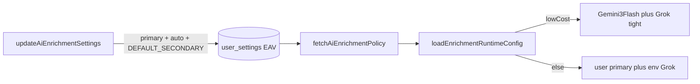

# Final polish: AI enrichment UX and i18n

## 0) Scope (approved extension)

- **Code (original five files):** [`AIEnrichmentSettingsCard.tsx`](src/components/features/settings/AIEnrichmentSettingsCard.tsx), [`AIEnrichmentModal.tsx`](src/components/features/companies/ai-enrichment/AIEnrichmentModal.tsx), [`company-enrichment-gateway.ts`](src/lib/ai/company-enrichment-gateway.ts), [`settings.ts`](src/lib/actions/settings.ts), [`ai-enrichment-policy.ts`](src/lib/services/ai-enrichment-policy.ts).
- **Messages (approved):** [`src/messages/en.json`](src/messages/en.json), [`src/messages/de.json`](src/messages/de.json), [`src/messages/hr.json`](src/messages/hr.json) — add keys only; keep JSON valid and parallel structure across locales.

## 1) What is already done vs what this pass does

| Area | Current state | This pass |
|------|----------------|-----------|
| One model selector | Single registry `Select` on primary in settings; save forces `auto` + default secondary in [`settings.ts`](src/lib/actions/settings.ts) | No structural change; optional **rename local state** to `gatewayModelId` for readability only if it stays type-safe with snapshot. |
| Session model picker | **Already removed** from modal; only read-only “This run” + `researchCompanyEnrichment(..., { modelMode: "auto" })` | Verify no dead imports; optionally **retire unused** `companies.aiEnrich.*` keys later (out of scope unless you want a separate cleanup PR). |
| Low-cost toggle | Global EAV key; gateway branch unchanged | Replace **hardcoded English** in settings + modal with `t(...)`. |
| English strings | Settings: “Low-cost mode” label/help/aria; Modal: `enrichmentApproxRelativeCostHint` returns English; error block: “Code:”, “gen”, Vercel credits paragraph, “Token usage (from gateway):”; low-cost paragraph | Move all user-visible copy to **settings** / **companies** message trees. |
| Policy | Still exposes `modelPreference` + `secondaryGatewayModelId` for [`company-enrichment.ts`](src/lib/actions/company-enrichment.ts) / contact merge (out of scope to remove) | **Minimal:** JSDoc on `AiEnrichmentPolicy` / `fetchAiEnrichmentPolicy` clarifying that **gateway** ignores DB secondary for routing (uses `resolveEnrichmentGrokGatewayModelId()`); optional one-line comment at `secondaryGatewayModelId` read. No behavior change unless you add optional snapshot normalization (same as earlier plan — skip unless needed for UI consistency). |
| Gateway | `loadEnrichmentRuntimeConfig` already uses fixed Grok fallback when not low-cost | **Optional:** comment-only polish; no logic change. |

## 2) Single model flow (unchanged architecture)

- **Settings card:** one `primaryGatewayModelId` selector; low-cost switch.
- **Modal:** no per-session model override; display model derived from `modelUsed` / snapshot / low-cost preview (existing logic).
- **Server actions** (not edited): still merge `modelPreference` → `EnrichmentModelMode`; persisted `auto` keeps current behavior.

## 3) Error messaging stays excellent and actionable

- **Keep** the same alert layout: user-facing resolved message + optional `enrichmentFailureDetail` (stable code, HTTP, generation id, gateway message, token hint, Vercel credits hint branch).
- **Translate** static UI chrome only: labels like “Code:”, “gen”, “Token usage (from gateway):”, and the Vercel credits helper sentence — by adding keys under `companies.aiEnrich` (e.g. `diagnosticCodeLabel`, `diagnosticGenPrefix`, `diagnosticTokenUsageLabel`, `errorVercelCreditsActionHint`) and using `t()` in the modal.
- **Gateway / provider messages** inside `gatewayMessage` stay as returned by the API (debug value); do not translate raw gateway text.

## 4) Message keys to add (representative)

Under **`settings.aiEnrichment`:**

- `lowCostModeLabel`, `lowCostModeHelp`, `lowCostModeAria` (German-friendly copy in `de.json`).

Under **`companies.aiEnrich`:**

- `lowCostModeActiveNotice` (modal banner under model line).
- Cost hints: `costHintLower`, `costHintHigher`, `costHintLowCostSettings` (replace strings in `enrichmentApproxRelativeCostHint` by passing `t` from `useT("companies")` into a small helper or inlining `t()` calls where the hint is computed).
- Diagnostic chrome: `diagnosticCodeLabel`, `diagnosticHttpPrefix`, `diagnosticGenPrefix`, `diagnosticTokenUsageLabel`, `errorVercelCreditsActionHint` (or fewer keys if you merge sentences).

Mirror every new key in **en**, **de**, **hr** so locale switching never falls back to missing keys.

## 5) Quality gate

- `pnpm typecheck && pnpm check:fix` with zero errors/warnings.
- Quick manual check: Settings AI card + open company AI modal — no raw English for the above strings in DE/EN/HR.

## 6) Rollout order (execution)

1. Add / sync keys in `en.json`, `de.json`, `hr.json`.
2. [`AIEnrichmentSettingsCard.tsx`](src/components/features/settings/AIEnrichmentSettingsCard.tsx) — wire low-cost label/help/aria-label to `t("settings.aiEnrichment.*")`.
3. [`AIEnrichmentModal.tsx`](src/components/features/companies/ai-enrichment/AIEnrichmentModal.tsx) — cost hints + low-cost notice + diagnostic banner strings via `t("companies.aiEnrich.*")`; pass `t` into helper or compute hints inside component after `const t = useT("companies")`.
4. [`ai-enrichment-policy.ts`](src/lib/services/ai-enrichment-policy.ts) — JSDoc / comment-only minimal cleanup.
5. [`company-enrichment-gateway.ts`](src/lib/ai/company-enrichment-gateway.ts) — comment-only if still useful; otherwise skip.
6. [`settings.ts`](src/lib/actions/settings.ts) — no change unless typecheck requires a trivial export touch (unlikely).

**Note:** “Show complete per-file code” in your template is not practical in-plan; implementation will apply normal diffs in-repo. Final line after verification: **All changes pass `pnpm typecheck && pnpm check:fix`. Ready for review.**
