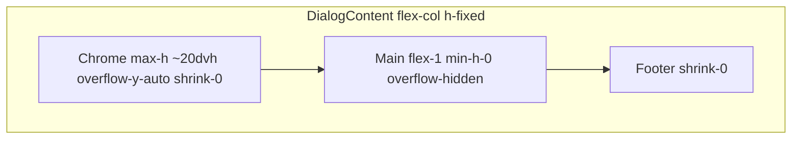

# AI enrichment modal: compact header + model re-run

## 1. Layout (flex proportions, compact header)

**Current problem:** The top block is a single [`shrink-0`](src/components/features/companies/ai-enrichment/AIEnrichmentModal.tsx) column stacking title, long description, model override (with help copy), a large usage card (progress + credits + address + Grok + nested “session model” block), errors, and retry. It can consume most of the dialog height; the middle [`flex-1`](src/components/features/companies/ai-enrichment/AIEnrichmentModal.tsx) region then fights for space.

**Target structure (same `DialogContent` flex column, only Tailwind):**

- **Chrome band:** Replace the unbounded top wrapper with something like `max-h-[min(20dvh,220px)] min-h-0 shrink-0 overflow-y-auto` (and tighter vertical padding: reduce `pt-14`/`sm:pt-16` and `space-y-2.5`/`sm:space-y-3` to smaller values) so meta stays visually ~10–20% of dialog height on typical viewports, with a **single scrollbar inside the band** on very small screens instead of pushing the table away.
- **Inside the band, compress without dropping features:**
  - **Title row:** Keep `DialogTitle`; shorten `DialogDescription` with `text-xs` / `line-clamp-2` or similar so it does not dominate.
  - **Controls row:** On `sm+`, use a horizontal flex/grid: left = compact “Modell ändern” (`SelectTrigger` `h-8`, `max-w-*`), right = compact usage line + thin `Progress` (e.g. `h-1`, `mt-1`) in one column; fold `modelOverrideHelp` into optional `sr-only` or a single `title` on the trigger if space is tight (prefer keeping visible one-line hint via `text-[10px]` under label only on `sm+` hidden / icon — keep minimal: one short line max).
  - **Usage card:** Remove nested heavy spacing: one combined block with uppercase labels as `text-[10px]`, credits/Grok/address/low-cost as **single-line or two-line** `text-[11px]` with `leading-tight`, merge “session model” into the same card as one row (label + badge) instead of a separate dashed subsection with extra `mt-3`/`pt-3`.
  - **Retry:** Keep next to errors but `size="sm"` in a compact row.
- **Error / diagnostics:** Either keep inside the capped band (scrollable) **or** move the `role="alert"` block to the **top of the main scroll column** (still in the same file) so errors do not inflate the chrome; diagnostics links and monospace blocks get `max-h-24 overflow-y-auto` (already partially there). Pick one approach for consistency; prefer **errors in main column** so the header stays truly short.

**Results area (80–90% feel):**

- Keep [`flex min-h-0 min-w-0 flex-1 flex-col overflow-hidden`](src/components/features/companies/ai-enrichment/AIEnrichmentModal.tsx) on the middle wrapper; add `min-h-0 basis-0 flex-1` if needed so flex allocates remaining height after `shrink-0` header + footer.
- Inside results, ensure the table wrapper keeps `min-h-0 flex-1 overflow-auto` so the table scrolls inside the large region.
- Optionally tighten summary / “model used” blocks above the table (`shrink-0`, smaller padding) so more pixels go to the table.

## 2. On-the-fly model change + immediate re-run

**Current behavior:** [`Select` is `disabled={isPending}`](src/components/features/companies/ai-enrichment/AIEnrichmentModal.tsx); changing the model updates [`modelOverrideRef`](src/components/features/companies/ai-enrichment/AIEnrichmentModal.tsx) in `useEffect` after paint, so a synchronous `mutate()` right after `setState` could read a stale ref. The initial open effect only calls `mutate()` once per open via [`runForOpenSessionRef`](src/components/features/companies/ai-enrichment/AIEnrichmentModal.tsx).

**Target behavior:**

1. **Enable the dropdown while pending:** Remove `disabled={isPending}` (or only disable during a micro-window if needed — prefer always enabled).
2. **Sync ref in the same handler as navigation:** In `onValueChange`, after validating the gateway id, set `modelOverrideRef.current` **synchronously** (still keep the existing `useEffect` sync for consistency), then update React state.
3. **Central `startEnrichmentRun()` (or equivalent):**
   - Increment a **`runGenerationRef`** (monotonic number).
   - Clear UI state for a fresh run: `setResult(null)`, `setModelUsed(null)`, `setSelected({})`, `setEnrichmentInlineError(null)`, `setEnrichmentFailureDetail(null)`, optionally reset progress.
   - Call [`reset()`](src/components/features/companies/ai-enrichment/AIEnrichmentModal.tsx) from the mutation to clear TanStack mutation flags, then **`mutate(runGeneration)`** passing the generation as **mutation variables** (TanStack Query v5 supports `mutate(variables)`).
4. **`useMutation` changes:**
   - `mutationFn: async (runGeneration: number) => { ... const res = await researchCompanyEnrichment(...); return { runGeneration, res }; }` (shape aligned with existing ok/error handling).
   - In **`onSuccess` / `onError`**: if `runGeneration !== runGenerationRef.current` (or compare to a “latest completed” ref updated only when accepting), **return early** — no `setResult`, no `toast.error`, no state updates for superseded runs. This avoids races when the previous server action completes after a newer run was started (client cannot truly abort the server action without gateway changes).
5. **Wire triggers:**
   - **Model `onValueChange`:** If the value equals the current pick (no-op), skip. Otherwise update pick + ref, then `startEnrichmentRun()`.
   - **Initial open `useEffect`:** Replace direct `mutateRef.current()` with the same `startEnrichmentRun()` (or pass generation through the same path) while preserving “run once per open” via `runForOpenSessionRef` / timeout cleanup.
   - **`handleRetry`:** Reuse `startEnrichmentRun()` so retry and model-change share one code path (still clears errors like today).

**Note:** True cancellation of in-flight HTTP is out of scope (server action, single file); the generation guard is the reliable fix for correctness.

## 3. Quality gate

After edits, run from repo root:

`pnpm typecheck && pnpm check:fix`

Ensure zero diagnostics; fix any hook dependency warnings Biome reports (e.g. if extracting `startEnrichmentRun` into `useCallback`, include stable deps or document intentional omission per project convention).

## Execution deliverable

When implementing (post-approval), output the **full** updated [`AIEnrichmentModal.tsx`](src/components/features/companies/ai-enrichment/AIEnrichmentModal.tsx) as requested, and close with: **All changes pass pnpm typecheck && pnpm check:fix. Ready for review.**
