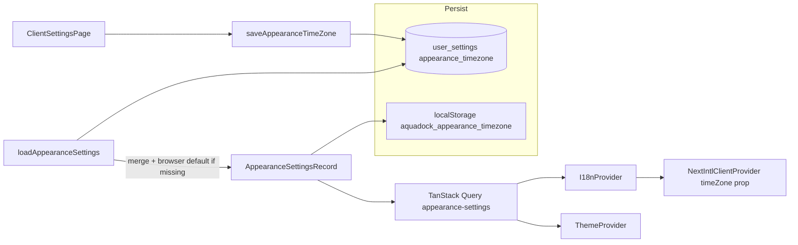

# Professional time zone selector + remove hardcoded Berlin

## Brief analysis

- **[`src/lib/i18n/provider.tsx`](src/lib/i18n/provider.tsx)** — `NextIntlClientProvider` hardcodes `timeZone="Europe/Berlin"`. Appearance comes from TanStack Query `["appearance-settings"]` via `loadAppearanceSettings()` with `placeholderData` seeded from `appearanceFromLocalStorageOrDefault()` (today: **locale only** from `LS_APPEARANCE_LOCALE`).
- **[`src/lib/services/user-settings.ts`](src/lib/services/user-settings.ts)** — `APPEARANCE_SETTING_KEYS` lists `theme`, `locale`, `colorScheme`. `loadAppearanceSettings` merges three rows; `DEFAULT_APPEARANCE` is the fallback object.
- **[`src/lib/validations/appearance.ts`](src/lib/validations/appearance.ts)** — Defines `AppearanceSettingsRecord` and parsers for theme/locale/color; no timezone yet.
- **[`src/app/(protected)/settings/ClientSettingsPage.tsx`](src/app/(protected)/settings/ClientSettingsPage.tsx)** — Appearance card uses three `Select`s and mutations that call `saveAppearance*` + invalidate `["appearance-settings"]`.
- **[`src/components/theme/ThemeProvider.tsx`](src/components/theme/ThemeProvider.tsx)** — `persistAppearanceLocalMirror`, `appearanceRecordKey`, and `AppearanceHydration` sync DB → DOM/localStorage. **Must include `timeZone`** in the record key so a timezone-only save still runs persistence; extend `persistAppearanceLocalMirror` with a new LS key.
- **Dependencies** — `cmdk` is already in [`package.json`](package.json). There is **no** `@radix-ui/react-popover` or `components/ui/command.tsx`; use **`Dialog` + `cmdk`** for a searchable, grouped picker without adding packages.



## Implementation plan

### 1. Validation — [`src/lib/validations/appearance.ts`](src/lib/validations/appearance.ts)

- Add **`isValidIanaTimeZone(id: string): boolean`** using `try { new Intl.DateTimeFormat("en-US", { timeZone: id }).format(new Date()); return true; } catch { return false; }` (no `!`, no `as any`).
- Add **`appearanceTimeZoneSchema`**: `z.string().trim().min(1).refine(isValidIanaTimeZone, { message: "…" })` with a short German-friendly message (aligned with CRM audience) or reuse a neutral key if you prefer messages-only errors in UI.
- Add **`AppearanceTimeZone`** as `z.infer<typeof appearanceTimeZoneSchema>`.
- Extend **`AppearanceSettingsRecord`** with **`timeZone: string`** (stored value is always a valid IANA ID after parse).
- Add **`parseAppearanceTimeZone(value: unknown): string | null`** mirroring other parsers (null/undefined → null; string → trim → safeParse).

### 2. Constants — [`src/lib/constants/theme.ts`](src/lib/constants/theme.ts)

- Add **`LS_APPEARANCE_TIMEZONE = "aquadock_appearance_timezone"`** next to the other `LS_APPEARANCE_*` keys.

### 3. Timezone catalog + labels — **new** [`src/lib/constants/appearance-timezones.ts`](src/lib/constants/appearance-timezones.ts) (or `src/lib/i18n/timezones.ts`)

- **`getAppearanceTimeZoneGroups()`** (or build once): use **`Intl.supportedValuesOf("timeZone")`** when available (guard `typeof Intl.supportedValuesOf === "function"`); **fallback** to a curated static list of common IANA IDs (EU capitals + US + Asia hubs) so older environments still work.
- **Group** by prefix: `Europe`, `America`, `Africa`, `Asia`, `Australia`, `Pacific`, `Atlantic`, `Indian`, `Antarctica`, `Arctic`, else **`Other`**.
- **`getDefaultAppearanceTimeZone()`**: `resolvedOptions().timeZone` if valid per `isValidIanaTimeZone`, else **`"UTC"`** — used when no DB value and on SSR-safe defaults.
- **`formatTimeZoneMenuLabel(iana: string, localeTag: string): string`** — e.g. last path segment with `_` → space, plus **`shortOffset`** via `Intl.DateTimeFormat(..., { timeZone: iana, timeZoneName: "shortOffset" }).formatToParts` for a compact “city (UTC±…)” line. Sort groups and items by this label.

### 4. Service layer — [`src/lib/services/user-settings.ts`](src/lib/services/user-settings.ts)

- Extend **`APPEARANCE_SETTING_KEYS`** with **`timezone: "appearance_timezone"`** (matches your requested key).
- Extend **`DEFAULT_APPEARANCE`** with **`timeZone: "UTC"`** (static, SSR-safe; runtime resolution below).
- **`loadAppearanceSettings`**: add `appearance_timezone` to the `.in("key", …)` list; parse with **`parseAppearanceTimeZone`**; if still missing after loop, set **`timeZone` to `getDefaultAppearanceTimeZone()`** when `typeof window !== "undefined"`, else keep **`DEFAULT_APPEARANCE.timeZone`**.
- Add **`saveAppearanceTimeZone(timeZone: AppearanceTimeZone): Promise<void>`** — same upsert pattern as `saveAppearanceLocale`.
- Import types/parser from `@/lib/validations/appearance` and **`getDefaultAppearanceTimeZone`** from the new constants module.

### 5. I18n provider — [`src/lib/i18n/provider.tsx`](src/lib/i18n/provider.tsx)

- Extend **`appearanceFromLocalStorageOrDefault()`** to read **`LS_APPEARANCE_TIMEZONE`** via **`parseAppearanceTimeZone`**, merging into the returned record when valid.
- **`useLayoutEffect` / `setSyncAppearance`**: include **`timeZone`** in the shallow equality check (like `locale` / `theme` / `colorScheme`).
- Pass **`timeZone={appearanceRecord.timeZone}`** (not hardcoded) to **`NextIntlClientProvider`**; keep **`now={new Date()}`**.

### 6. Theme hydration mirror — [`src/components/theme/ThemeProvider.tsx`](src/components/theme/ThemeProvider.tsx)

- Import **`LS_APPEARANCE_TIMEZONE`** and **`parseAppearanceTimeZone`**.
- **`persistAppearanceLocalMirror`**: `localStorage.setItem(LS_APPEARANCE_TIMEZONE, record.timeZone)`.
- **`appearanceRecordKey`**: append **`|${record.timeZone}`** so timezone-only updates still sync.
- Optional: in the initial **`useLayoutEffect`**, if LS has a valid timezone string, you could store it for other consumers; **not required** for next-intl if I18nProvider already reads LS — keep changes minimal and consistent with existing locale mirror pattern.

### 7. UI — Appearance card + reusable picker

- **New** [`src/components/ui/command.tsx`](src/components/ui/command.tsx) — standard shadcn/ui **Command** primitives (`cmdk` + `cn`), matching existing [`src/components/ui/dialog.tsx`](src/components/ui/dialog.tsx) / [`button.tsx`](src/components/ui/button.tsx) styling conventions (data-slot, border, rounded-md, etc.).
- **New** [`src/components/features/settings/AppearanceTimezoneSelect.tsx`](src/components/features/settings/AppearanceTimezoneSelect.tsx) (or under `settings/` beside page):
  - Props: `value: string`, `onValueChange: (tz: string) => void`, `disabled?: boolean`, `id` for label association.
  - **`Dialog`** with trigger styled like existing **`SelectTrigger`** (`w-full max-w-md`, chevron).
  - Inside content: **`Command`** with **`CommandInput`** (search), **`CommandEmpty`**, **`CommandList`**, map **`getAppearanceTimeZoneGroups()`** to **`CommandGroup`** heading + **`CommandItem`** per zone; on select, call `onValueChange`, close dialog.
  - Use **`useT("settings")`** (or `common`) for search placeholder / empty state / dialog title; group headings can use **`settings.appearance.timezoneRegion.*`** keys (Europe, Americas, …) in **de / en / hr** for parity (**[`scripts/validate-message-keys.mjs`](scripts/validate-message-keys.mjs)**).
- **[`src/app/(protected)/settings/ClientSettingsPage.tsx`](src/app/(protected)/settings/ClientSettingsPage.tsx)** — Import **`saveAppearanceTimeZone`**, **`appearanceTimeZoneSchema`**, add **`useMutation`** like other appearance fields, place **one new `space-y-2` block** (Label + `AppearanceTimezoneSelect`) after language (or before date preview — your call; language + timezone together reads well). Invalidate **`["appearance-settings"]`** on success; toasts via new **`settings.appearance`** keys.

### 8. Messages — [`src/messages/de.json`](src/messages/de.json), [`en.json`](src/messages/en.json), [`hr.json`](src/messages/hr.json)

Under **`settings.appearance`**, add e.g.:

- `timezoneLabel`, `timezoneSearchPlaceholder`, `timezoneDialogTitle`, `timezoneEmpty`, `timezoneSaved`, `timezoneSaveErrorTitle`
- `timezoneRegionEurope`, `timezoneRegionAmericas`, `timezoneRegionAfrica`, `timezoneRegionAsia`, `timezoneRegionAustralia`, `timezoneRegionPacific`, `timezoneRegionAtlantic`, `timezoneRegionIndian`, `timezoneRegionAntarctica`, `timezoneRegionArctic`, `timezoneRegionOther`

Run **`pnpm messages:validate`** after edits.

### 9. Quality gate

```bash
pnpm typecheck && pnpm check:fix && pnpm messages:validate
```

## Files touched (summary)

| Area | Files |
|------|--------|
| Schema/types | [`appearance.ts`](src/lib/validations/appearance.ts) |
| Catalog/helpers | **new** `appearance-timezones.ts` (path as above) |
| LS key | [`theme.ts`](src/lib/constants/theme.ts) |
| DB load/save | [`user-settings.ts`](src/lib/services/user-settings.ts) |
| next-intl | [`provider.tsx`](src/lib/i18n/provider.tsx) |
| Mirror / key | [`ThemeProvider.tsx`](src/components/theme/ThemeProvider.tsx) |
| shadcn cmdk | **new** [`command.tsx`](src/components/ui/command.tsx) |
| Picker | **new** `AppearanceTimezoneSelect.tsx` |
| Settings page | [`ClientSettingsPage.tsx`](src/app/(protected)/settings/ClientSettingsPage.tsx) |
| i18n | `de.json`, `en.json`, `hr.json` |

## Note on “full code in markdown blocks”

Plan mode here stores the plan in-repo; **full file dumps for every touched file would exceed practical length** (especially `ClientSettingsPage.tsx` and the new Command component). After you approve the plan, implementation should apply the edits directly in the repo; the steps above are explicit enough to implement without ambiguity. If you want every line pasted in chat, say so and we can split by file in follow-up messages.
