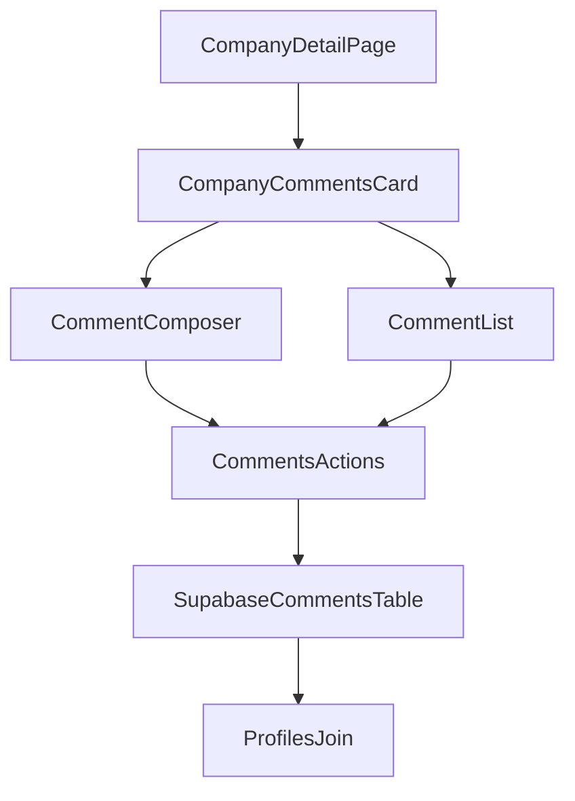

# Company Comment Card Phase 1 Plan

## Goal
Ship a professional comment experience on the company detail view with a dedicated backend model (thread-ready), while keeping current timeline features untouched.

## Scope (Confirmed)
- Data model: dedicated comments model
- Rollout target: company detail page only
- No contact page integration in phase 1

## Step-by-Step Implementation

1. **Add database tables for comments and attachments (foundation-first)**
- Create migration SQL files in [/Users/marco/code/aquadock-crm-v5/src/sql]( /Users/marco/code/aquadock-crm-v5/src/sql ) for:
  - `comments` table with `id`, `entity_type`, `entity_id`, `body_markdown`, `parent_id`, `created_by`, `updated_by`, `created_at`, `updated_at`, `deleted_at`
  - Optional phase-1-safe `comment_attachments` table (schema only, can stay unused in UI)
- Constrain `entity_type` to start with `company` only (expandable later).
- Index for hot queries: `(entity_type, entity_id, created_at desc)` and `parent_id`.

2. **Apply RLS + policies aligned with existing project style**
- Extend policy SQL near existing RLS scripts in [/Users/marco/code/aquadock-crm-v5/src/sql/rls-setup.sql]( /Users/marco/code/aquadock-crm-v5/src/sql/rls-setup.sql ) and [/Users/marco/code/aquadock-crm-v5/src/sql/role-based-rls.sql]( /Users/marco/code/aquadock-crm-v5/src/sql/role-based-rls.sql ).
- Enforce authenticated read/write and ownership checks for update/delete.
- Keep soft-delete semantics (`deleted_at`) consistent with existing CRM patterns.

3. **Regenerate Supabase types and expose app aliases**
- Regenerate [/Users/marco/code/aquadock-crm-v5/src/types/supabase.ts]( /Users/marco/code/aquadock-crm-v5/src/types/supabase.ts ) after migration.
- Add aliases in [/Users/marco/code/aquadock-crm-v5/src/types/database.types.ts]( /Users/marco/code/aquadock-crm-v5/src/types/database.types.ts ):
  - `Comment`, `CommentInsert`, `CommentUpdate`
  - `CommentWithAuthor` join shape for UI (`profiles.display_name`).

4. **Create validation layer for comment payloads**
- Add [/Users/marco/code/aquadock-crm-v5/src/lib/validations/comment.ts]( /Users/marco/code/aquadock-crm-v5/src/lib/validations/comment.ts ):
  - `createCommentSchema`, `updateCommentSchema`
  - Limits for body length and optional markdown sanitization boundary.
- Export via [/Users/marco/code/aquadock-crm-v5/src/lib/validations/index.ts]( /Users/marco/code/aquadock-crm-v5/src/lib/validations/index.ts ).

5. **Implement data actions (CRUD) for company comments**
- Add server actions in [/Users/marco/code/aquadock-crm-v5/src/lib/actions/comments.ts]( /Users/marco/code/aquadock-crm-v5/src/lib/actions/comments.ts ):
  - `listCompanyComments(companyId)`
  - `createCompanyComment({ companyId, bodyMarkdown, parentId? })`
  - `updateComment({ commentId, bodyMarkdown })`
  - `deleteComment(commentId)` (soft delete)
- Re-export in [/Users/marco/code/aquadock-crm-v5/src/lib/actions/index.ts]( /Users/marco/code/aquadock-crm-v5/src/lib/actions/index.ts ).
- Match existing ownership/error behavior patterns used in [/Users/marco/code/aquadock-crm-v5/src/lib/actions/timeline.ts]( /Users/marco/code/aquadock-crm-v5/src/lib/actions/timeline.ts ) and [/Users/marco/code/aquadock-crm-v5/src/lib/actions/crm-trash.ts]( /Users/marco/code/aquadock-crm-v5/src/lib/actions/crm-trash.ts ).

6. **Build comment UI primitives (composer + card + list)**
- Create components:
  - [/Users/marco/code/aquadock-crm-v5/src/components/company-detail/CompanyCommentsCard.tsx]( /Users/marco/code/aquadock-crm-v5/src/components/company-detail/CompanyCommentsCard.tsx )
  - [/Users/marco/code/aquadock-crm-v5/src/components/features/comments/CommentComposer.tsx]( /Users/marco/code/aquadock-crm-v5/src/components/features/comments/CommentComposer.tsx )
  - [/Users/marco/code/aquadock-crm-v5/src/components/features/comments/CommentItem.tsx]( /Users/marco/code/aquadock-crm-v5/src/components/features/comments/CommentItem.tsx )
- UI behaviors:
  - Rich textarea with write/preview tabs (sanitized preview)
  - author avatar/name, timestamp, edited indicator
  - inline edit + delete for owners/admins
  - optimistic updates with TanStack Query and rollback on failure

7. **Integrate into company detail page**
- Insert new card in [/Users/marco/code/aquadock-crm-v5/src/app/(protected)/companies/[id]/CompanyDetailClient.tsx]( /Users/marco/code/aquadock-crm-v5/src/app/(protected)/companies/[id]/CompanyDetailClient.tsx ), positioned near `TimelineCard`.
- Keep `TimelineCard` untouched for phase 1 to reduce migration risk.
- Use a dedicated query key family, e.g. `['comments', 'company', companyId]`.

8. **Localization and copy updates**
- Add `comments` namespace keys to:
  - [/Users/marco/code/aquadock-crm-v5/src/messages/en.json]( /Users/marco/code/aquadock-crm-v5/src/messages/en.json )
  - [/Users/marco/code/aquadock-crm-v5/src/messages/de.json]( /Users/marco/code/aquadock-crm-v5/src/messages/de.json )
  - [/Users/marco/code/aquadock-crm-v5/src/messages/hr.json]( /Users/marco/code/aquadock-crm-v5/src/messages/hr.json )
- Include toast/error/empty-state and preview labels.

9. **Add tests before rollout completion**
- Validation tests: [/Users/marco/code/aquadock-crm-v5/src/lib/validations/comment.test.ts]( /Users/marco/code/aquadock-crm-v5/src/lib/validations/comment.test.ts )
- Action tests: [/Users/marco/code/aquadock-crm-v5/src/lib/actions/comments.test.ts]( /Users/marco/code/aquadock-crm-v5/src/lib/actions/comments.test.ts )
- UI tests: [/Users/marco/code/aquadock-crm-v5/src/components/company-detail/__tests__/CompanyCommentsCard.test.tsx]( /Users/marco/code/aquadock-crm-v5/src/components/company-detail/__tests__/CompanyCommentsCard.test.tsx )
- Cover create, edit, delete, optimistic update rollback, and empty/loading states.

10. **Phase 1 release checklist**
- Run: typecheck, lint/check, targeted tests.
- Verify permissions manually with at least 2 users.
- Confirm no regressions on existing timeline CRUD at company detail.

## Architecture Snapshot

## Non-goals (Phase 1)
- Contact-page comments
- Full threaded UI rendering beyond single-level parent support
- Attachment uploads in the UI (schema can exist now, UX later)
- Replacing the timeline module
