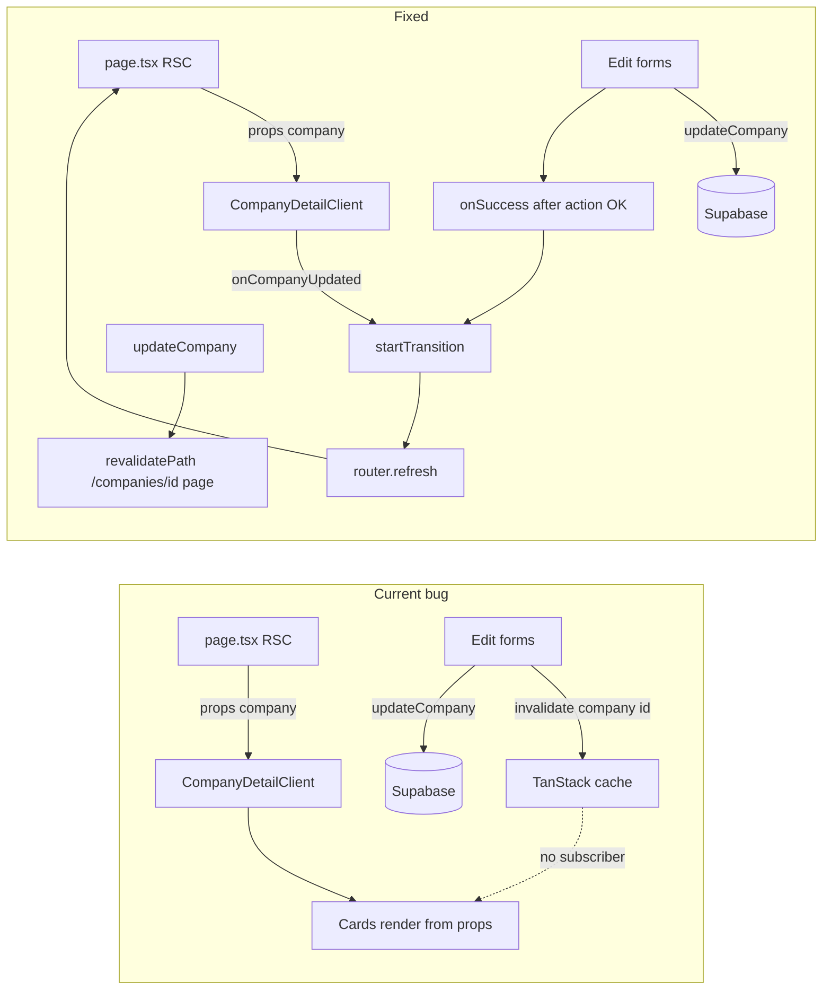

# Company detail cards refresh after inline edits

## File confirmation (edit only these; double-checked)

- **Main wiring:** [`src/app/(protected)/companies/[id]/CompanyDetailClient.tsx`](src/app/(protected)/companies/[id]/CompanyDetailClient.tsx)
- **Cards:** [`src/components/company-detail/CompanyDetailsCard.tsx`](src/components/company-detail/CompanyDetailsCard.tsx), [`src/components/company-detail/AquaDockCard.tsx`](src/components/company-detail/AquaDockCard.tsx)
- **Server action:** [`src/lib/actions/companies.ts`](src/lib/actions/companies.ts) — **`updateCompany` only**
- **Page:** [`src/app/(protected)/companies/[id]/page.tsx`](src/app/(protected)/companies/[id]/page.tsx) — **leave untouched** unless a caching flag appears later
- **Test (new):** [`src/app/(protected)/companies/[id]/__tests__/company-detail-refresh.test.tsx`](src/app/(protected)/companies/[id]/__tests__/company-detail-refresh.test.tsx)

There is no `CompanyDetailCards.tsx`. Firmendaten + Adresse live in `CompanyDetailsCard.tsx`; AquaDock Daten in `AquaDockCard.tsx`.

## Root cause (exact)

- [`page.tsx`](src/app/(protected)/companies/[id]/page.tsx) loads `company` once via `resolveCompanyDetail` and passes it into [`CompanyDetailClient.tsx`](src/app/(protected)/companies/[id]/CompanyDetailClient.tsx) as props.
- [`CompanyDetailsCard.tsx`](src/components/company-detail/CompanyDetailsCard.tsx) and [`AquaDockCard.tsx`](src/components/company-detail/AquaDockCard.tsx) render **only from that `company` prop**; they do not read a `useQuery(["company", id])` result.
- Edit forms call [`updateCompany`](src/lib/actions/companies.ts) and invalidate `["company", id]`, but **nothing on the detail page consumes that query key**, so the DOM never updates until a full reload.
- No `router.refresh()` or `revalidatePath` for this route in this flow today.

## Fix strategy (minimal)

### 1. [`CompanyDetailClient.tsx`](src/app/(protected)/companies/[id]/CompanyDetailClient.tsx) (primary wiring)

- Import `useTransition` from `react` (hook-first: declare with other hooks, no conditional hooks).
- Define `refreshCompanyDetail` with `useCallback` that runs **`startTransition(() => { router.refresh(); })`** so the refresh is non-blocking and matches React 19 / Next best practice for smoother UX.
- Pass `onCompanyUpdated={refreshCompanyDetail}` into `CompanyDetailsCard` and `AquaDockCard`. The cards invoke this from each inline form’s **`onSuccess`**, which already runs **after** the server action completes successfully (mutation `onSuccess` runs when `updateCompany` resolves).
- **Full company edit dialog:** extend existing `CompanyEditForm` `onSuccess` to also call the same `startTransition(() => router.refresh())` (today it only invalidates `["company", id]` — same staleness for header/KPIs). Keeps all wiring in this file.

### 2. [`CompanyDetailsCard.tsx`](src/components/company-detail/CompanyDetailsCard.tsx)

- Optional prop `onCompanyUpdated?: () => void`.
- `FirmendatenEditForm` / `AdresseEditForm`: `onSuccess` chains `onCompanyUpdated?.()` then existing `set*Open(false)`.

### 3. [`AquaDockCard.tsx`](src/components/company-detail/AquaDockCard.tsx)

- Same optional `onCompanyUpdated` and chain on `AquaDockEditForm` `onSuccess`.

Do not change Tailwind/shadcn structure or the three edit form files (out of allowed list).

### 4. [`src/lib/actions/companies.ts`](src/lib/actions/companies.ts) — `updateCompany` only

```ts
import { revalidatePath } from "next/cache";
// after successful update:
revalidatePath(`/companies/${id}`, "page");
```

Precision: second argument `'page'` targets that dynamic segment’s page data. Client still uses `router.refresh()` for immediate UI without a full document reload.

### 5. [`page.tsx`](src/app/(protected)/companies/[id]/page.tsx)

- **No change** unless a separate caching issue is discovered.

### 6. [`src/lib/validations/company.ts`](src/lib/validations/company.ts)

- Skip (none expected).

## Vitest: [`company-detail-refresh.test.tsx`](src/app/(protected)/companies/[id]/__tests__/company-detail-refresh.test.tsx)

**Goal:** After mocked `updateCompany` success, **card body** (not dialog) shows new values without `window.location` reload.

**Harness / mocks:**

- `vi.hoisted` + file-local `vi.mock("next/navigation", …)` with a stable `mockRouter` whose `refresh` updates harness state (simulates RSC refetch after `router.refresh()`).
- `QueryClientProvider` (queries/mutations retry false), as in [`CompanyForm.test.tsx`](src/components/features/companies/CompanyForm.test.tsx).
- `vi.mock("@/lib/actions/companies", …)` for `updateCompany`; merge updates in implementation + ref for harness merge on refresh.
- **`vi.mock("sonner")`** — mock `toast.success` / `toast.error` to avoid console noise (explicit nice-to-have).
- `vi.mock("@/lib/i18n/use-translations", …)` stub `useT` like [`DashboardStats.test.tsx`](src/components/features/dashboard/DashboardStats.test.tsx).

**Assertions:**

- Use **`waitFor` + `screen.getByText(newValue)`** on content that lives in the **card body** (outside the dialog), after submit + simulated refresh — proves the regression is fixed for real displayed data.

**Coverage:**

- **Three required tests:** Firmendaten, Adresse, AquaDock inline edits.
- **Bonus (recommended):** one test opening the **full company edit** dialog from the header flow, submit, assert a visible field outside the dialog (e.g. header or a KPI/card fed by `company`) updates after the same `refresh` pattern — documents that dialog had the same staleness class and stays fixed.

**Selectors:** Icon-only edit buttons — `within` on card/header or scoped `getByRole("button")` without new `data-testid` unless unavoidable.

## Out of scope (do not implement now)

- Extract `useRefreshCompanyDetail(id)` in `src/hooks/` for reminders/contacts/etc. — optional future consistency; **not** part of this ticket.

## Quality gate

`pnpm typecheck && pnpm check:fix` and `pnpm test` until green.

## Summary diagram


