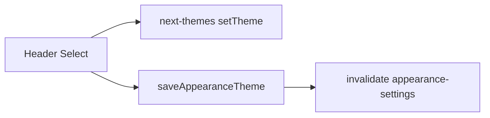

# Header theme Select + remove Settings duplicate

## UX analysis

Today the same preference is controlled in two places: a **cryptic icon toggle** in the header (cycles system/light/dark in a non-obvious way) and an **explicit Select** under Settings. That duplicates mental model and hides the real stored value (“System” vs resolved light/dark). Moving a compact **shadcn Select** into the header matches common SaaS patterns (Linear/Vercel): the **stored mode** is always visible, changing it is one clear action, and persistence stays aligned with what `next-themes` and your hydration layer already apply on load.

## Architecture (unchanged data path)

- [`saveAppearanceTheme`](src/lib/services/user-settings.ts) already upserts `user_settings` via the browser Supabase client (same as today’s Settings mutation).
- [`ClientLayout` / `ThemeProvider` / appearance hydration](src) continue to own defaults and reload behavior; **no changes** there.
- **System default** remains whatever your existing hydration + `DEFAULT_APPEARANCE` already enforce.

## 1. [`src/components/layout/Header.tsx`](src/components/layout/Header.tsx)

**Replace** the ghost `Button` block (lines ~202–220) with a **minimal shadcn `Select`** (`SelectTrigger` / `SelectContent` / `SelectItem` / `SelectValue` from [`@/components/ui/select`](src/components/ui/select.tsx)).

**Behavior**

- `const { theme, setTheme, resolvedTheme } = useTheme()` — keep `resolvedTheme` for the logo swap and `mounted` guard.
- **Value**: bind to `theme` (`light` | `dark` | `system`). Until `mounted`, avoid SSR/client mismatch: either `undefined` value + placeholder, or `disabled` + neutral placeholder (same idea as current `suppressHydrationWarning` on the toggle).
- **`onValueChange`**: `appearanceThemeSchema.safeParse(value)` from [`@/lib/validations/appearance`](src/lib/validations/appearance.ts); on success:
  1. **`setTheme(parsed.data)` immediately** so the UI updates like Linear/Vercel.
  2. Run persistence via **`useMutation`** calling `saveAppearanceTheme(parsed.data)` (same core as today’s [`appearanceThemeMutation`](src/app/(protected)/settings/ClientSettingsPage.tsx) in Settings: `mutationFn` + `onSuccess` → `queryClient.invalidateQueries({ queryKey: ["appearance-settings"] })` + success toast + `onError` toast).
- **Trigger presentation**: compact row — small **lucide** icon (`Sun` / `Moon` / `Monitor` for system) + label. Labels and toasts: second hook **`useT("settings")`** and reuse existing keys **`appearance.themeLight` / `themeDark` / `themeSystem`**, **`appearance.themeSaved`**, **`appearance.themeSaveErrorTitle`** (and `settings.common.unknownError` for generic errors) so **no `en.json` / `de.json` / `hr.json` edits** are required while staying fully i18n. Keep **`useT("layout")`** for existing layout copy (search, etc.) as today.
- **Styling**: `variant="ghost"`-like trigger width (e.g. `h-9`, `gap-2`, `border-0` or subtle `border border-border/60`, `text-muted-foreground`) — token-only, no new CSS variables; respect global `--radius`.
- **Dependencies**: add `useMutation` + `useQueryClient` from `@tanstack/react-query`, `toast` from `sonner`, `saveAppearanceTheme` from [`@/lib/services/user-settings`](src/lib/services/user-settings.ts), `appearanceThemeSchema` from validations. **Optional**: on mutation error, restore previous `theme` with a ref snapshot (nice polish; not required if you match current Settings behavior which does not roll back).

**Do not change** reminder queries, avatar menu, logo link, or search dialog.

## 2. [`src/app/(protected)/settings/ClientSettingsPage.tsx`](src/app/(protected)/settings/ClientSettingsPage.tsx)

**Remove completely**

- The theme **`
`** with `Label` + `Select` for `appearance-theme` (lines ~716–735 in the current file).
- **`appearanceThemeMutation`** (`useMutation` block ~359–372).
- **`useTheme`** import and `const { theme: nextTheme, setTheme } = useTheme()` — nothing else in this file uses them after removal.
- Imports only used for theme: `saveAppearanceTheme`, type `AppearanceTheme`, `appearanceThemeSchema`.

**Keep**

- `selectMounted` / `useEffect` that sets it — still required for OpenMap `Select`s (~969+).
- All other appearance controls (language, timezone, color), other mutations, and `appearanceLoading` in `isLoading`.

## 3. [`src/app/(protected)/settings/page.tsx`](src/app/(protected)/settings/page.tsx)

**No change** unless you want copy tweaks; not required for this feature.

## Verification (manual)

- Header: choose **Light / Dark / System** — UI switches immediately; reload and navigate routes — preference sticks (existing hydration).
- Settings: Appearance card shows **no theme row**; language/timezone/color still save.
- Locales **en / de / hr**: header labels match existing Settings strings.

## Deliverable note

After implementation, the “diff-style” summary you asked for is simply the two edited TSX hunks (Header: toggle → Select + imports/mutation; ClientSettingsPage: delete theme UI + dead code).
