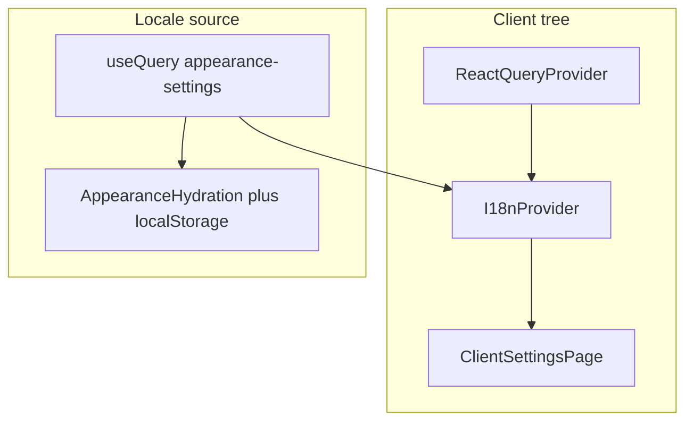

# Bilingual next-intl — pure client-side (AquaDock CRM v5)

## Goals

- **Production-ready de/en** using `next-intl` with **`NextIntlClientProvider` only** (no `createNextIntlPlugin`, no `src/i18n/request.ts`, no `next.config.ts` changes, no middleware, no `[locale]` routing).
- **Locale source**: TanStack Query `["appearance-settings"]` + `loadAppearanceSettings()`; default **`de`**; **`fr` in DB/UI legacy → treat as `de`** at parse + provider resolution.
- **Scope**: New `src/messages/*.json` + `src/lib/i18n/*`, small edits to [`src/app/(protected)/layout.tsx`](src/app/(protected)/layout.tsx), [`src/lib/validations/appearance.ts`](src/lib/validations/appearance.ts), and **[`ClientSettingsPage.tsx`](src/app/(protected)/settings/ClientSettingsPage.tsx) only** for copy. **Do not** change [`SmtpSettings`](src/components/email/SmtpSettings.tsx), Supabase services/clients, or root [`ThemeProvider`](src/components/theme/ThemeProvider.tsx) / [`app/layout.tsx`](src/app/layout.tsx) unless a follow-up explicitly requires it.

## Current codebase (facts)

- Locale persisted in `user_settings` key `appearance_locale` via [`loadAppearanceSettings`](src/lib/services/user-settings.ts) / [`saveAppearanceLocale`](src/lib/services/user-settings.ts); default in [`DEFAULT_APPEARANCE`](src/lib/services/user-settings.ts) is `locale: "de"`.
- [`ClientSettingsPage.tsx`](src/app/(protected)/settings/ClientSettingsPage.tsx) and [`ThemeProvider.tsx`](src/components/theme/ThemeProvider.tsx) share **`queryKey: ["appearance-settings"]`** — `I18nProvider` reusing the same key avoids duplicate fetches.
- [`AppearanceHydration`](src/components/theme/ThemeProvider.tsx) already sets **`document.documentElement.lang`** from appearance; root [`layout.tsx`](src/app/layout.tsx) still uses static `lang="de"` for SSR — acceptable for this phase.
- Settings page mixes languages; language `<Select>` includes bogus **`fr` / “Croatian”** ([`ClientSettingsPage.tsx`](src/app/(protected)/settings/ClientSettingsPage.tsx) ~582–584).
- [`appearanceLocaleSchema`](src/lib/validations/appearance.ts) currently includes **`fr`**.
- **`next-intl` is installed** but not wired.

## Architecture



- Locale at runtime = **resolved `en` | `de`** from query data (unknown / legacy `fr` → `de`).
- Messages: **static `import` of JSON** in [`src/lib/i18n/messages.ts`](src/lib/i18n/messages.ts) (or re-exported from `provider.tsx`); bundler includes both catalogs.

## Implementation steps

### 1. Message files — [`src/messages/de.json`](src/messages/de.json), [`src/messages/en.json`](src/messages/en.json)

- **Identical nesting** in both files (TypeScript `Messages` type from one file, e.g. `de.json`).
- Organize by **namespace** matching `useT`: e.g. top-level keys `settings`, `common` — then `settings.notifications.*`, `settings.appearance.*`, `settings.map.*`, `settings.openMap.*`, `settings.brevo.*`.
- **ICU** (required examples in UI):
  - **Plural** — e.g. active notification channels: `count` = sum of enabled push/email.
  - **Rich** — appearance help/footer or a toast via `t.rich` + safe tags (`<strong>`, `<code>`, etc.).
  - **Select** (optional) — theme labels `light` / `dark` / `system` if you want one message with `select` ICU; otherwise plain nested string keys are fine.
- Cover **every** user-visible string in `ClientSettingsPage.tsx` (cards, labels, descriptions, buttons, placeholders, toasts, `confirm()` copy). **Exclude** strings rendered only inside `SmtpSettings`.

### 2. Infrastructure — [`src/lib/i18n/`](src/lib/i18n/)

| File | Responsibility |
|------|------------------|
| `types.ts` | `export type AppLocale = "de" \| "en"`; `declare module "next-intl" { interface AppConfig { Locale; Messages } }` using `typeof` import of `de.json` ([docs](https://next-intl.dev/docs/workflows/typescript)). |
| `messages.ts` | `import de/en` from `@/messages/...`; `Record<AppLocale, Messages>`; `resolveAppLocale(raw)` (`en` → `en`, else `de`, including legacy `fr`); `getMessagesForLocale`. |
| `provider.tsx` | `"use client"`; `useQuery` same key + `queryFn` as existing appearance load; `useMemo` messages; `<NextIntlClientProvider locale messages timeZone="Europe/Berlin" now={new Date()}>`. While `data` is undefined, **`de`** locale + German messages is an acceptable fallback (matches default appearance). |
| `use-translations.ts` | `useFormat()` → `useFormatter()`; `useT(namespace)` → `useTranslations(namespace)` with a typed namespace key (e.g. `keyof IntlMessages` or literal union) so keys stay discoverable. |

### 3. Protected layout — [`src/app/(protected)/layout.tsx`](src/app/(protected)/layout.tsx)

- Wrap **`{children}`** with `<I18nProvider>` **inside** `<AppLayout>` so shell chrome and pages under `/` protected routes receive the provider. Order relative to root: **`ClientLayout` → `ReactQueryProvider` → … → protected layout → `I18nProvider`** (already satisfied).

### 4. Validation — [`src/lib/validations/appearance.ts`](src/lib/validations/appearance.ts)

- `appearanceLocaleSchema` → **`z.enum(["en", "de"])`**.
- **`parseAppearanceLocale`**: if stored value is **`"fr"`** (legacy) or fails enum parse, normalize to **`"de"`** (return `"de"` or `null` per existing contract — but **loaded `AppearanceSettingsRecord.locale` must never be `fr`** after read path, so prefer returning **`"de"`** for `fr` before or as part of parsing).

### 5. [`ClientSettingsPage.tsx`](src/app/(protected)/settings/ClientSettingsPage.tsx)

- **Hook-first / early-return** unchanged for loading skeleton.
- **`useT("settings")`** (and `useT("common")` if split) + **`useFormat()`** for labels and formatted date line.
- **Remove** `<SelectItem value="fr">…</SelectItem>`.
- **Keep** mutation bodies, query keys, Supabase usage; **keep** `onError` check **`message === NOTIFICATION_UI.toastValidationError`** so server action contract stays stable without editing actions.
- **Replace** display strings and client-only toasts (including notification success messages) with `t` / `t.rich`; drop **`getNotificationPreferenceSuccessToast`** usage if fully replaced by keys.
- **Add** plural line (notifications), **one** `t.rich` (appearance), **one** `format.dateTime(..., { dateStyle: "medium" })` example (appearance or footer).

## Out of scope (this plan)

- `next.config.ts`, `createNextIntlPlugin`, `src/i18n/request.ts`, middleware.
- `SmtpSettings.tsx`, Supabase client/service files, `ThemeProvider.tsx` / root `layout.tsx` (unless a later task).

## Verification

```bash
pnpm typecheck
pnpm check:fix
pnpm build
```

Manual: Settings → switch language → all migrated strings flip; plural + rich + date examples render; no console errors; validation toast path still works when server returns `NOTIFICATION_UI.toastValidationError`.

## Todo order (execution)

1. **messages-json** — JSON parity is the contract for types and `useT` keys.  
2. **i18n-lib** — provider depends on messages map.  
3. **protected-layout** — consumers must be under provider.  
4. **appearance-schema** — safe `Select` value + save path.  
5. **client-settings** — largest diff last.
