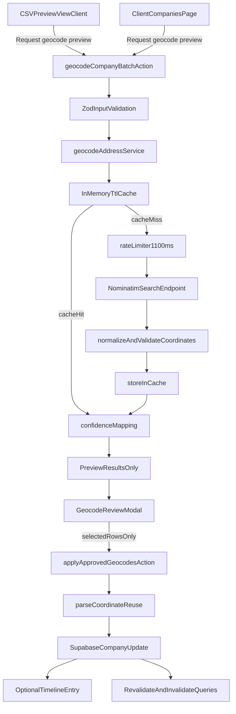

# AquaDock CRM v5 – Nominatim Geocoding Implementation Plan (2026-04-16)

## Executive Summary And Business Value

Phase 4 adds a production-safe geocoding layer that helps users complete missing or invalid coordinates without leaving CRM workflows. The feature is preview-first and approval-driven, improving data quality while keeping user control.

Business outcomes:
- Higher map coverage and better geospatial downstream quality (`wasserdistanz`, map navigation, location-driven segmentation).
- Reduced manual correction effort during CSV onboarding and ongoing data hygiene.
- Audit-friendly and policy-compliant geocoding behavior suitable for production operations.

## Compliance Requirements (Nominatim + Internal Rules)

### Nominatim policy compliance
- Request pacing: **minimum 1.1 seconds between outgoing requests** (stricter than 1 req/sec).
- Custom User-Agent: **exact string** used on every request:
  - `AquaDockCRMv5-Geocoder/2026.04 (+https://aquadock-crm-glqn.vercel.app; contact:m.graf@aquadock.de)`
- Caching: in-memory server cache with TTL to reduce repeated calls.
- Request shape: structured query fields (`street`, `postalcode`, `city`, `country`) and explicit `countrycodes=de`, `accept-language=de`.

### Internal architecture compliance
- Server-only geocoding logic in server action + server utility; no direct client-side Nominatim calls.
- Zod schemas remain source of truth for payload validation in server actions.
- No `!`, no `as any`, no conditional hooks, no array index as React key.
- Final gate after each file and at end: `pnpm typecheck && pnpm check:fix`.

## Technical Architecture



## Strict File Allowlist (Only These Files)

1. **New** [src/lib/utils/geocode-nominatim.ts](/Users/marco/code/aquadock-crm-v5/src/lib/utils/geocode-nominatim.ts)
2. **Modify** [src/lib/actions/companies.ts](/Users/marco/code/aquadock-crm-v5/src/lib/actions/companies.ts)
3. **New** [src/components/features/companies/GeocodeReviewModal.tsx](/Users/marco/code/aquadock-crm-v5/src/components/features/companies/GeocodeReviewModal.tsx)
4. **Modify** [src/components/features/companies/CSVPreviewView.tsx](/Users/marco/code/aquadock-crm-v5/src/components/features/companies/CSVPreviewView.tsx)
5. **Modify** [src/app/(protected)/companies/ClientCompaniesPage.tsx](/Users/marco/code/aquadock-crm-v5/src/app/(protected)/companies/ClientCompaniesPage.tsx)
6. **Conditional/Optional** [src/lib/utils/geo.ts](/Users/marco/code/aquadock-crm-v5/src/lib/utils/geo.ts) (only if shared geocode types or confidence helpers are extracted)
7. **Optional note update only** [src/lib/constants/csv-import-fields.ts](/Users/marco/code/aquadock-crm-v5/src/lib/constants/csv-import-fields.ts)

No other files are touched.

## Phased Implementation Order

### Priority 1 – Core geocoding utility and server actions

#### 1) `src/lib/utils/geocode-nominatim.ts` (new)
- Implement server-safe `geocodeAddress` utility with:
  - Structured query assembly from `strasse`, `plz`, `stadt`, `land`.
  - `countrycodes=de`, `addressdetails=1`, `limit=1`, `format=jsonv2`, `accept-language=de`.
  - Global module-level rate-limit gate (`nextAllowedAt`) with 1100ms spacing.
  - Module-level in-memory cache (`Map<string, CacheEntry>`) with TTL (recommended 24h).
  - Confidence mapping from Nominatim `importance`:
    - `> 0.7` => `high`/green
    - `0.4 - 0.7` => `medium`/yellow
    - `< 0.4` => `low`/red
  - Friendly failure reason codes (`NO_RESULT`, `INCOMPLETE_ADDRESS`, `NETWORK_ERROR`, `POLICY_THROTTLED`).

Quality gate after file:
- `pnpm typecheck && pnpm check:fix`

#### 2) `src/lib/actions/companies.ts` (modify)
- Add validated server action `geocodeCompanyBatch`:
  - Input supports both CSV rows and existing company records using one normalized address payload.
  - Returns **preview results only** (no DB writes).
- Add second action `applyApprovedGeocodes`:
  - Accepts selected approved rows only.
  - Reuses `parseCoordinate` from `src/lib/utils/csv-import.ts` before update writes.
  - Updates `lat`/`lon` only for rows explicitly approved.
  - Optional timeline insert per updated company via existing server timeline path.
- Keep all Nominatim fetch usage delegated to `geocode-nominatim.ts`.

Quality gate after file:
- `pnpm typecheck && pnpm check:fix`

### Priority 2 – UX modal and integration points

#### 3) `src/components/features/companies/GeocodeReviewModal.tsx` (new)
- Build a review-first modal component that displays:
  - Original address.
  - Suggested coordinates.
  - Confidence badge color (green/yellow/red).
  - Result message for non-match rows.
  - Row checkbox + select all + apply selected.
- No direct API calls inside utility code; component receives callbacks to server actions.

Quality gate after file:
- `pnpm typecheck && pnpm check:fix`

#### 4) `src/components/features/companies/CSVPreviewView.tsx` (modify)
- Add `Koordinaten vervollständigen` trigger for CSV preview context.
- Request geocode preview for rows with missing/invalid `lat`/`lon` and sufficient address fields.
- Open `GeocodeReviewModal` with preview payload.
- Apply selected results into in-memory preview rows only (still no DB write before CSV import).

Quality gate after file:
- `pnpm typecheck && pnpm check:fix`

#### 5) `src/app/(protected)/companies/ClientCompaniesPage.tsx` (modify)
- Add bulk action button (`Koordinaten vervollständigen`) beside existing selection actions.
- Collect selected company IDs, fetch required address fields from current rows, call preview action.
- Show `GeocodeReviewModal` for selective approval.
- Apply approved rows via dedicated apply action, then invalidate companies query and show toast summary.

Quality gate after file:
- `pnpm typecheck && pnpm check:fix`

### Priority 2.5 – Optional extraction/documentation

#### 6) `src/lib/utils/geo.ts` (conditional)
- Only if needed, extract shared types/helpers (`GeoConfidenceLevel`, badge color resolver) to avoid duplication.

Quality gate after file:
- `pnpm typecheck && pnpm check:fix`

#### 7) `src/lib/constants/csv-import-fields.ts` (optional note update)
- Add concise note in examples/docs that missing coordinates can be geocode-assisted during preview.

Quality gate after file:
- `pnpm typecheck && pnpm check:fix`

## Critical Code Sketches

### A) `geocodeAddress` utility sketch (`src/lib/utils/geocode-nominatim.ts`)

```ts
// server-only utility
export type GeocodeConfidence = "high" | "medium" | "low";

export type GeocodeAddressInput = {
  strasse?: string | null;
  plz?: string | null;
  stadt?: string | null;
  land?: string | null;
};

export type GeocodeAddressResult = {
  ok: boolean;
  lat: number | null;
  lon: number | null;
  confidence: GeocodeConfidence | null;
  importance: number | null;
  displayName: string | null;
  source: "cache" | "nominatim";
  reason?: "NO_RESULT" | "INCOMPLETE_ADDRESS" | "NETWORK_ERROR" | "INVALID_COORDINATE";
};

const NOMINATIM_URL = "https://nominatim.openstreetmap.org/search";
const USER_AGENT = "AquaDockCRMv5-Geocoder/2026.04 (+https://aquadock-crm-glqn.vercel.app; contact:m.graf@aquadock.de)";
const CACHE_TTL_MS = 24 * 60 * 60 * 1000;
const cache = new Map<string, { expiresAt: number; value: GeocodeAddressResult }>();
let nextAllowedAt = 0;

function confidenceFromImportance(importance: number): GeocodeConfidence {
  if (importance > 0.7) return "high";
  if (importance >= 0.4) return "medium";
  return "low";
}

async function waitForRateLimit() {
  const now = Date.now();
  const waitMs = Math.max(0, nextAllowedAt - now);
  if (waitMs > 0) await new Promise((resolve) => setTimeout(resolve, waitMs));
  nextAllowedAt = Date.now() + 1100;
}

export async function geocodeAddress(input: GeocodeAddressInput): Promise<GeocodeAddressResult> {
  // validate minimum address quality
  // build normalized cache key from strasse/plz/stadt/land
  // return cached result when not expired
  // await waitForRateLimit()
  // fetch structured Nominatim query with countrycodes=de and accept-language=de
  // parse first result, map confidence, validate coordinate range
  // cache + return
}
```

### B) `geocodeCompanyBatch` preview action sketch (`src/lib/actions/companies.ts`)

```ts
const geocodeBatchInputSchema = z
  .object({
    items: z.array(
      z.object({
        rowId: z.string().min(1),
        companyId: z.string().uuid().optional(),
        firmenname: z.string().trim().optional(),
        strasse: z.string().trim().nullable().optional(),
        plz: z.string().trim().nullable().optional(),
        stadt: z.string().trim().nullable().optional(),
        land: z.string().trim().nullable().optional(),
        currentLat: z.number().nullable().optional(),
        currentLon: z.number().nullable().optional(),
      }),
    ),
  })
  .strict();

export async function geocodeCompanyBatch(input: unknown) {
  const parsed = geocodeBatchInputSchema.parse(input);

  const results = await Promise.all(
    parsed.items.map(async (item) => {
      const geocode = await geocodeAddress({
        strasse: item.strasse,
        plz: item.plz,
        stadt: item.stadt,
        land: item.land,
      });

      return {
        rowId: item.rowId,
        companyId: item.companyId ?? null,
        firmenname: item.firmenname ?? null,
        currentLat: item.currentLat ?? null,
        currentLon: item.currentLon ?? null,
        suggestedLat: geocode.lat,
        suggestedLon: geocode.lon,
        confidence: geocode.confidence,
        importance: geocode.importance,
        displayName: geocode.displayName,
        source: geocode.source,
        ok: geocode.ok,
        message: geocode.ok ? null : "Keine passende Geokodierung gefunden",
      };
    }),
  );

  return {
    ok: true,
    previewOnly: true,
    results,
  };
}
```

### C) `GeocodeReviewModal` sketch (`src/components/features/companies/GeocodeReviewModal.tsx`)

```tsx
export type GeocodePreviewRow = {
  rowId: string;
  companyId?: string | null;
  firmenname?: string | null;
  addressLabel: string;
  currentLat: number | null;
  currentLon: number | null;
  suggestedLat: number | null;
  suggestedLon: number | null;
  confidence: "high" | "medium" | "low" | null;
  message: string | null;
  ok: boolean;
};

export function GeocodeReviewModal(props: {
  open: boolean;
  rows: GeocodePreviewRow[];
  isApplying: boolean;
  onOpenChange: (open: boolean) => void;
  onApplySelected: (selectedRowIds: string[]) => void;
}) {
  // useMemo for selectable rows
  // useState<Record<string, boolean>> for checkbox map (rowId keys only)
  // confidence badge colors:
  // high=green, medium=yellow, low=red
  // rows with ok=false show warning text + remain unchecked by default
  // footer: apply selected + cancel
}
```

### D) Integration hook sketch in `CSVPreviewView.tsx`

```tsx
// new props
onOpenGeocodePreview: () => void;
geocodePending: boolean;

<Button
  type="button"
  variant="outline"
  onClick={onOpenGeocodePreview}
  disabled={isImporting || geocodePending || rows.length === 0}
>
  {geocodePending ? "Koordinaten werden gesucht..." : "Koordinaten vervollständigen"}
</Button>

// when modal apply returns selected rows:
// merge selected suggested coordinates into local preview rows
// run parseCoordinate(String(value), "lat"|"lon") before setting row fields
```

### E) Integration hook sketch in `ClientCompaniesPage.tsx`

```tsx
// Add selection action button near delete
<Button
  variant="secondary"
  size="sm"
  onClick={handleOpenGeocodeReview}
  disabled={selectedIds.length === 0 || geocodePreviewPending}
>
  Koordinaten vervollständigen
</Button>

// 1) Build payload from selected table rows
// 2) call geocodeCompanyBatch({ items })
// 3) open GeocodeReviewModal
// 4) applyApprovedGeocodes({ rows: selectedApprovedRows })
// 5) invalidate ["companies"] and show success/error toast summary
```

## Confidence, Fallback, And Approval Rules

- Confidence color mapping:
  - Green: `importance > 0.7`
  - Yellow: `0.4 <= importance <= 0.7`
  - Red: `importance < 0.4`
- Non-match rows are kept visible with explicit message and manual-edit fallback in UI.
- No auto-write from preview action. Writes happen only through explicit user selection and apply action.
- CSV flow updates local preview rows first, then existing import action persists them.

## Audit And Timeline Strategy

- On `applyApprovedGeocodes`, optional per-company timeline entry through existing authenticated timeline service.
- Suggested event content: geocoding source (`nominatim`/`cache`), old/new coordinates, confidence label.
- Keep timeline writes best-effort (do not block coordinate update if timeline insertion fails; return warning summary).

## Quality Gate Protocol (After Every File)

For each file in execution order:
1. Implement one file only.
2. Run: `pnpm typecheck && pnpm check:fix`
3. Confirm zero warnings/errors.
4. Present diff + gate result.
5. Wait for user command `next`.

## Post-Implementation Checklist

- Re-run one-time coordinate cleanup SQL if historic invalid coordinates still exist (from earlier phases).
- Validate CSV preview geocoding with real German addresses (street + postal + city).
- Validate companies bulk flow on mixed-quality records (complete, partial, invalid addresses).
- Verify policy pacing behavior under batch load (1.1s spacing visible in logs).
- Verify no client-side Nominatim calls are introduced.
- Verify timeline entries (if enabled) are correctly attached and human-readable.

## Execution Protocol

- Stop after plan approval.
- Wait for explicit command: **`START NOMINATIM PHASE 1`**.
- Then implement exactly one file at a time, in the priority order above.
- After each file: show diff + quality gate confirmation and wait for `next`.
