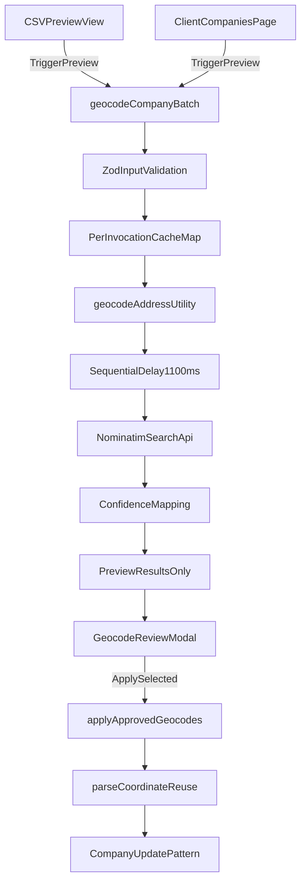

# AquaDock CRM v5 – Refined Nominatim Geocoding Implementation Plan (2026-04-16)

## Executive Summary

Phase 4 introduces a preview-first, approval-based Nominatim geocoding workflow in two places:
- CSV import preview for rows with missing/invalid coordinates.
- Companies list bulk action for existing records.

The refined approach is intentionally simple and hardened:
- Server-only geocoding logic.
- No global in-memory state assumptions across serverless invocations.
- Explicit user approval before writes.
- Minimal UI surface changes to preserve current component structure and reduce regression risk.

## Compliance And Guardrails

### Nominatim policy compliance
- Endpoint: `https://nominatim.openstreetmap.org/search`
- Exact User-Agent header:
  - `AquaDockCRMv5-Geocoder/2026.04 (+https://crm.aquadock.de)`
- Query style: structured parameters only (`street`, `postalcode`, `city`, `country`)
- Always include:
  - `countrycodes=de`
  - `accept-language=de`
  - `format=jsonv2`
  - `limit=1`
- Throttling model (refined): sequential requests with `1100ms` delay **inside one server action invocation**.

### Architecture and coding constraints
- Nominatim calls only from server-side utility/action layers.
- Client components call server actions only.
- No `!`, no `as any`, no conditional hooks, no array index as key.
- Reuse `parseCoordinate` when applying approved suggestions.
- Server actions remain thin and delegate geocoding logic to utility.

## Simplified Architecture



## Strict File Allowlist

Only these files are in scope:

1. New: [src/lib/utils/geocode-nominatim.ts](/Users/marco/code/aquadock-crm-v5/src/lib/utils/geocode-nominatim.ts)
2. Modify: [src/lib/actions/companies.ts](/Users/marco/code/aquadock-crm-v5/src/lib/actions/companies.ts)
3. New: [src/components/features/companies/GeocodeReviewModal.tsx](/Users/marco/code/aquadock-crm-v5/src/components/features/companies/GeocodeReviewModal.tsx)
4. Modify: [src/components/features/companies/CSVPreviewView.tsx](/Users/marco/code/aquadock-crm-v5/src/components/features/companies/CSVPreviewView.tsx)
5. Modify: [src/app/(protected)/companies/ClientCompaniesPage.tsx](/Users/marco/code/aquadock-crm-v5/src/app/(protected)/companies/ClientCompaniesPage.tsx)

Out of scope unless explicitly re-approved:
- `src/lib/utils/geo.ts`
- `src/lib/constants/csv-import-fields.ts`

## Phased Implementation Order

## Priority 1 – Core

### Step 1: Create `src/lib/utils/geocode-nominatim.ts`
- Implement `geocodeAddress` and related types.
- Accept structured address input (`strasse`, `plz`, `stadt`, `land`).
- Build deterministic cache key from normalized address fields.
- Return normalized result (`lat`, `lon`, `importance`, confidence bucket, display name, reason).
- No global throttling/cache state.

Implementation notes:
- Cache is passed in by caller or created per action invocation and injected.
- Include comment: this per-invocation cache is intentionally simple and should be replaced with Redis/Upstash for cross-invocation caching if needed.

Quality gate after step:
- `pnpm typecheck && pnpm check:fix`

### Step 2: Modify `src/lib/actions/companies.ts`
Add two server actions:

1) `geocodeCompanyBatch`
- Input: normalized batch items for CSV rows and/or existing companies.
- Validate with Zod.
- Process sequentially for small batches (<50), sleeping `1100ms` between outgoing requests.
- Use per-invocation cache map during this run.
- Return preview payload only; no DB writes.

2) `applyApprovedGeocodes`
- Input: array of approved suggestions `{ companyId?; rowId?; suggestedLat; suggestedLon }`.
- Re-parse coordinates via `parseCoordinate(String(value), "lat" | "lon")` before write.
- Apply company updates using existing server update patterns.
- Return success/failure summary per item.

Quality gate after step:
- `pnpm typecheck && pnpm check:fix`

## Priority 2 – UI

### Step 3: Create `src/components/features/companies/GeocodeReviewModal.tsx`
- Client component (`"use client"`).
- shadcn/ui only: `Dialog`, `Table`, `Badge`, `Checkbox`, `Button`.
- Features:
  - Confidence badges (green/yellow/red).
  - Select All Valid.
  - Apply Selected.
  - Cancel.
- No direct fetch; actions invoked through props callbacks.

Quality gate after step:
- `pnpm typecheck && pnpm check:fix`

### Step 4: Minimal integration in `src/components/features/companies/CSVPreviewView.tsx`
- Add one `Koordinaten vervollständigen` trigger button.
- On trigger: open modal with pre-fetched preview data passed from parent flow.
- Keep existing preview structure intact; avoid unrelated refactors.

Quality gate after step:
- `pnpm typecheck && pnpm check:fix`

### Step 5: Minimal integration in `src/app/(protected)/companies/ClientCompaniesPage.tsx`
- Add one bulk geocoding button in selection actions area.
- Trigger preview action and open `GeocodeReviewModal`.
- On apply, call `applyApprovedGeocodes` and invalidate relevant queries.
- Preserve existing table/dialog composition.

Quality gate after step:
- `pnpm typecheck && pnpm check:fix`

## Updated Code Sketches (Hardened + Simplified)

### 1) `geocode-nominatim.ts` utility sketch

```ts
export type GeocodeConfidence = "high" | "medium" | "low";

export type GeocodeAddressInput = {
  strasse?: string | null;
  plz?: string | null;
  stadt?: string | null;
  land?: string | null;
};

export type GeocodeAddressResult = {
  ok: boolean;
  lat: number | null;
  lon: number | null;
  importance: number | null;
  confidence: GeocodeConfidence | null;
  displayName: string | null;
  reason: "NO_RESULT" | "INCOMPLETE_ADDRESS" | "NETWORK_ERROR" | "INVALID_COORDINATE" | null;
};

const NOMINATIM_SEARCH_URL = "https://nominatim.openstreetmap.org/search";
const NOMINATIM_USER_AGENT = "AquaDockCRMv5-Geocoder/2026.04 (+https://crm.aquadock.de)";

function mapConfidence(importance: number): GeocodeConfidence {
  if (importance > 0.7) return "high";
  if (importance >= 0.4) return "medium";
  return "low";
}

export async function geocodeAddress(
  input: GeocodeAddressInput,
  cache: Map<string, GeocodeAddressResult>,
): Promise<GeocodeAddressResult> {
  // normalize + validate minimum address requirements
  // read/write cache from provided per-invocation map
  // fetch structured query with countrycodes=de and accept-language=de
  // parse first result and return normalized preview result
  // NOTE: per-invocation cache only; future upgrade: Redis/Upstash shared cache
}
```

### 2) `geocodeCompanyBatch` sketch with per-invocation delay

```ts
const geocodeBatchSchema = z
  .object({
    items: z.array(
      z.object({
        rowId: z.string().min(1),
        companyId: z.string().uuid().optional(),
        firmenname: z.string().trim().optional(),
        strasse: z.string().trim().nullable().optional(),
        plz: z.string().trim().nullable().optional(),
        stadt: z.string().trim().nullable().optional(),
        land: z.string().trim().nullable().optional(),
      }),
    ).max(50),
  })
  .strict();

export async function geocodeCompanyBatch(input: unknown) {
  const parsed = geocodeBatchSchema.parse(input);
  const cache = new Map<string, GeocodeAddressResult>();
  const results: Array<unknown> = [];

  for (let i = 0; i < parsed.items.length; i += 1) {
    if (i > 0) {
      await new Promise((resolve) => setTimeout(resolve, 1100));
    }

    const item = parsed.items[i];
    if (!item) {
      continue;
    }

    const geo = await geocodeAddress(
      {
        strasse: item.strasse,
        plz: item.plz,
        stadt: item.stadt,
        land: item.land,
      },
      cache,
    );

    results.push({
      rowId: item.rowId,
      companyId: item.companyId ?? null,
      firmenname: item.firmenname ?? null,
      suggestedLat: geo.lat,
      suggestedLon: geo.lon,
      confidence: geo.confidence,
      importance: geo.importance,
      displayName: geo.displayName,
      ok: geo.ok,
      message: geo.ok ? null : geo.reason,
    });
  }

  return { ok: true, previewOnly: true, results };
}
```

### 3) `applyApprovedGeocodes` sketch

```ts
const applySchema = z
  .object({
    items: z.array(
      z.object({
        companyId: z.string().uuid().optional(),
        rowId: z.string().min(1).optional(),
        suggestedLat: z.number(),
        suggestedLon: z.number(),
      }),
    ).min(1),
  })
  .strict();

export async function applyApprovedGeocodes(input: unknown) {
  const parsed = applySchema.parse(input);

  // For CSV preview-only rows without companyId, return sanitized values to client.
  // For existing companies (companyId present), persist through existing update pattern.
  // Always validate with parseCoordinate before write.

  // return summary: applied, skipped, errors[]
}
```

### 4) `GeocodeReviewModal.tsx` sketch

```tsx
"use client";

export function GeocodeReviewModal(props: {
  open: boolean;
  rows: GeocodePreviewRow[];
  isApplying: boolean;
  onOpenChange: (open: boolean) => void;
  onApplySelected: (rowIds: string[]) => void;
}) {
  // render Dialog + Table
  // confidence badge colors:
  // high => green, medium => yellow, low => red
  // actions: Select All Valid, Apply Selected, Cancel
}
```

### 5) Minimal integration sketch (CSV + Companies page)

```tsx
// CSVPreviewView.tsx
<Button type="button" variant="outline" onClick={onOpenGeocodeReview}>
  Koordinaten vervollständigen
</Button>

// ClientCompaniesPage.tsx selectionActions
<Button variant="secondary" size="sm" onClick={handleBulkGeocodePreview}>
  Koordinaten vervollständigen
</Button>
```

## Quality Gate Protocol

After each file (strict):
1. Complete exactly one file.
2. Run `pnpm typecheck && pnpm check:fix`.
3. Confirm zero warnings/errors.
4. Show diff + gate confirmation.
5. Wait for `next`.

## Execution Protocol

- Do not begin code changes until explicit user command:
  - `START NOMINATIM PHASE 1`
- Then execute strictly in the order listed above.
- Keep scope locked to allowlist.
- After each file, stop and wait for `next`.
