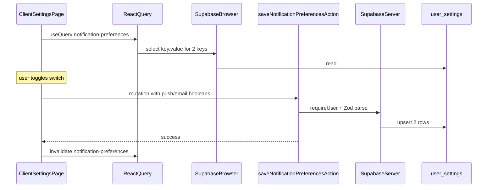

# Notifications Card Implementation Plan

## 1. Analysis: current card and `user_settings` usage

**Current Notifications UI** ([`ClientSettingsPage.tsx`](src/app/(protected)/settings/ClientSettingsPage.tsx)) uses local `useState(true)` for both toggles (lines 66–67, 271–283). Nothing is persisted.

**`user_settings` shape** (from [`src/types/supabase.ts`](src/types/supabase.ts)): rows are `{ user_id, key, value: Json, ... }` with one row per key per user (`onConflict: "user_id,key"` is already used for Brevo sender fields in the same file).

**Existing patterns to mirror**

- **Brevo sender block** in the same page: `useQuery` loads `key, value` with `.in("key", [...])`, parses rows; `useMutation` upserts two rows. Your requirements explicitly prefer **server action + service** for writes instead of client `upsert` for notifications—so reads can stay **browser Supabase** (read-only, RLS-safe), writes go through **`saveNotificationPreferencesAction`**.
- **Service layer** ([`user-settings.ts`](src/lib/services/user-settings.ts)): already has `getUserSettings` / `upsertUserSetting` using the **browser** client. For server actions we need functions that accept a **`SupabaseClient<Database>`** (same idea as [`src/lib/supabase/services/reminders.ts`](src/lib/supabase/services/reminders.ts) / other services that take `client` as argument) so **`"use server"`** code never imports `@/lib/supabase/browser`.

**Pre-existing quirk (out of scope for allowed files):** the page-wide `useQuery` with `from("user_settings").select("*").single()` is not aligned with a multi-row EAV table. **Do not rely on it for notifications.** Add a **separate** query key (e.g. `["notification-preferences"]`) like Brevo.

## 2. Proposed data model and keys

| Key | `value` type (JSON) | Default (if row missing) |
|-----|---------------------|---------------------------|
| `notification_push_enabled` | boolean | `true` (matches previous local default) |
| `notification_email_enabled` | boolean | `true` |

**Parsing:** treat `value` as boolean when `typeof value === "boolean"`; optionally accept legacy string `"true"` / `"false"` for robustness; otherwise fall back to defaults.

**Constants** (new [`src/lib/constants/notifications.ts`](src/lib/constants/notifications.ts)): export key strings and default booleans so keys are not duplicated across service, action, and client.

## 3. UI/UX improvements (within the Notifications card only)

- Import and use **`CardDescription`** from [`src/components/ui/card.tsx`](src/components/ui/card.tsx) for a short German overview of what the card controls.
- **Per option:** keep **Label + Switch** on one row; add **`text-muted-foreground text-xs` (or `text-sm`)** helper copy under the label stack (German), e.g. browser push for tasks/reminders; email alerts for important updates—wording can match your product tone.
- **Loading:** while the notification `useQuery` is loading (or user is unresolved), **disable** switches (and optionally show a subtle `animate-pulse` on the card content—minimal).
- **Saving:** on toggle, call **one mutation** with the **full** `{ pushEnabled, emailEnabled }` so state stays consistent. **`isPending`** disables both switches (or the whole card row group) to prevent double-submits.
- **Feedback:** **`toast.success`** with German messages reflecting **aktiviert / deaktiviert** for the type that changed (derive `changed: "push" | "email"` from previous vs next in `onSuccess` or pass through mutation meta). **`toast.error`** on failure with a short German description (reuse pattern from Brevo mutation in the same file).
- **Dark mode / shadcn:** rely on existing `Card`, `Label`, `Switch`, `text-muted-foreground`, `border-border`, etc.—no new theme tokens.

**Remove** the standalone English line *"Configure how you receive notifications"* at the bottom if it is redundant once `CardDescription` + per-row help exist (keeps the card clean).

## 4. Persistence and feedback flow

1. **New Zod schema** [`src/lib/validations/settings.ts`](src/lib/validations/settings.ts): e.g. `notificationPreferencesSchema = z.object({ pushEnabled: z.boolean(), emailEnabled: z.boolean() }).strict()` plus exported `NotificationPreferences`/`Form` type via `z.infer`.
2. **Service** [`user-settings.ts`](src/lib/services/user-settings.ts): add  
   - `fetchNotificationPreferences(client, userId)` → `{ pushEnabled, emailEnabled }` using `.in("key", [...])`  
   - `upsertNotificationPreferences(client, userId, prefs)` → two `upsert`s with `onConflict: "user_id,key"`, `value` as boolean JSON  
   Use [`handleSupabaseError`](src/lib/supabase/db-error-utils.ts) for consistent errors (same as existing helpers in that file).
3. **Server action** [`src/lib/actions/notifications.ts`](src/lib/actions/notifications.ts): `"use server"`; `await requireUser()` (same as [`brevo.ts`](src/lib/actions/brevo.ts)); `createServerSupabaseClient()`; `notificationPreferencesSchema.safeParse(input)` — on failure throw a clear `Error` for the client; on success call `upsertNotificationPreferences`.
4. **Client** [`ClientSettingsPage.tsx`](src/app/(protected)/settings/ClientSettingsPage.tsx):  
   - Drop local notification state.  
   - `useQuery({ queryKey: ["notification-preferences"], queryFn: ... })` using `createClient()` + `auth.getUser()` + `fetchNotificationPreferences(supabase, user.id)` (import service function; **no DB writes from the client** for these keys).  
   - `useMutation` calling the server action; `onSuccess`: `invalidateQueries` for `["notification-preferences"]`, success toast; `onError`: error toast.

## 5. Risks and mitigations

| Risk | Mitigation |
|------|------------|
| RLS denies read/write | Same table as Brevo keys; if Brevo sender works for the user, these rows should too. If not, fix RLS in Supabase (outside allowed files). |
| `user-settings.ts` mixing browser + server concerns | Only add **client-parameterized** functions; keep existing browser-only helpers unchanged; server action imports server client + new helpers—no `"use server"` in `user-settings.ts`. |
| Double row upsert not atomic | Two upserts in sequence; acceptable for preferences. If one fails, surface error and invalidate to refetch. |
| Wrong `["settings"]` query behavior | Do not use it for notifications; isolated query key. |
| Barrel file drift | **Do not** edit [`src/lib/validations/index.ts`](src/lib/validations/index.ts) (not in your allowlist); import `@/lib/validations/settings` directly from the action and anywhere else needed. |

## 6. Implementation checklist (only the 5 allowed files)

1. Add [`src/lib/constants/notifications.ts`](src/lib/constants/notifications.ts) — keys + defaults.  
2. Add [`src/lib/validations/settings.ts`](src/lib/validations/settings.ts) — strict Zod schema + inferred type.  
3. Extend [`src/lib/services/user-settings.ts`](src/lib/services/user-settings.ts) — `fetchNotificationPreferences` + `upsertNotificationPreferences` with injected `SupabaseClient<Database>`.  
4. Add [`src/lib/actions/notifications.ts`](src/lib/actions/notifications.ts) — `saveNotificationPreferencesAction` (or equivalent name) with `requireUser`, parse, upsert.  
5. Update [`ClientSettingsPage.tsx`](src/app/(protected)/settings/ClientSettingsPage.tsx) — Notifications card UI + React Query + mutation + toasts + loading/disabled.

## 7. Verification (after you approve implementation)

- `pnpm typecheck` — zero errors.  
- `pnpm check:fix` — zero warnings.  
- Manual: toggle each switch, reload page, confirm values stick; verify German toasts for on/off.
