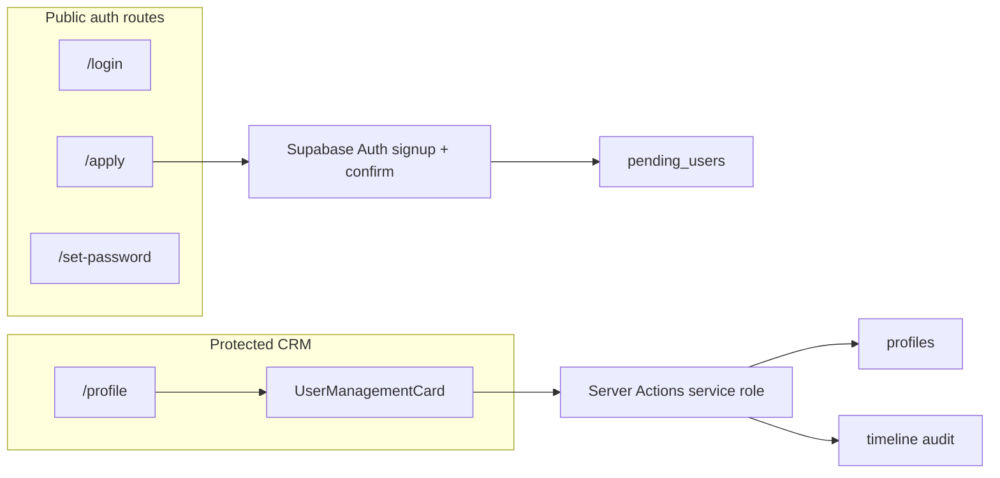

# AquaDock CRM v5 – Complete Implementation Plan: Professional User Onboarding Flow

## 1. Summary of Current State & Root Causes

**Canonical User Management UI**

- The **live** component is [`src/components/features/profile/UserManagementCard.tsx`](src/components/features/profile/UserManagementCard.tsx). It is rendered from [`src/app/(protected)/profile/page.tsx`](src/app/(protected)/profile/page.tsx) inside the admin-only block (`role === "admin"`), alongside [`AdminTrashBinCard`](src/components/features/profile/AdminTrashBinCard.tsx).
- A **duplicate/legacy** file exists at [`src/components/profile/UserManagementCard.tsx`](src/components/profile/UserManagementCard.tsx) (simpler feature set, `window.location.reload` after delete). **Nothing in the profile route imports it** (grep shows only the `features` path). This is a maintenance risk and should be consolidated or deleted during implementation to avoid drift.

**Password reset & user creation (server)**

- [`src/lib/services/profile.ts`](src/lib/services/profile.ts) (`'use server'`) implements:
  - **`triggerPasswordReset(userId)`** — loads target email via `createAdminClient().auth.admin.getUserById`, then calls **`auth.resetPasswordForEmail(email, { redirectTo })`** with `redirectTo` from [`resolveAuthRecoveryRedirectUrl()`](src/lib/utils/auth-recovery-redirect.ts) (currently **`…/login`**).
  - **`createUser`** — `auth.admin.createUser` with random password, profile upsert, then **`serviceSupabase.auth.resetPasswordForEmail`** with the same recovery redirect helper.
- **No `crypt()` / raw `auth.users` password updates** appear anywhere in the TypeScript/SQL search path for this repo (grep over the workspace returned no matches). If production still exhibits “manual hash” behavior, it may be from **older deployed code**, **direct SQL in Supabase**, or **misconfiguration** (e.g. wrong `redirectTo`, rate limits, or using a client API that does not match Supabase’s documented admin recovery pattern). The **first fix** should be to **verify** the Supabase JS API behavior for the **service-role client** (`createAdminClient`): if `resetPasswordForEmail` is unreliable or undocumented for admin flows, migrate to the **supported** pattern: **`auth.admin.generateLink({ type: 'recovery', email, options: { redirectTo } })`** (and optionally send the link via your own mailer), or use the **anon** client’s `resetPasswordForEmail` only where docs guarantee it—**without** ever writing to `encrypted_password` in SQL.

**Login / recovery UX**

- [`src/app/(auth)/login/page.tsx`](src/app/(auth)/login/page.tsx) is a **client** page using `@supabase/auth-ui-react` for sign-in, plus a substantial **password recovery** path (`PasswordRecoveryUpdatePanel`, hash/session handling, `supabase.auth.updateUser({ password })`). On success it currently **`router.replace("/login")`**, not `/dashboard`—the new onboarding spec requires **auto-login + `/dashboard`** after set-password for the **grant** flow (see phases below).

**SMTP in-app**

- [`src/lib/services/smtp.ts`](src/lib/services/smtp.ts) exposes **`getSmtpConfig()`** which reads **`user_settings`** (`key: smtp_config`) for the **currently authenticated** user. Mass email ([`src/lib/actions/mass-email.ts`](src/lib/actions/mass-email.ts)) uses this pattern.
- **Gap:** Public “apply” and **server-side** notifications to admins **cannot** use `getSmtpConfig()` as written (no session). This must be solved with a **designated** SMTP source (see §6 and §9).

**Timeline audit**

- Inserts typically go through [`createTimelineEntry`](src/lib/services/timeline.ts) with a user-scoped Supabase client. [`src/sql/rls-setup.sql`](src/sql/rls-setup.sql) shows timeline **INSERT** policy **`WITH CHECK (auth.uid() IS NOT NULL)`** (no `user_id = auth.uid()` constraint in that snapshot—worth treating carefully in security review).
- For events **without** a normal session (pre-confirm apply) or for **service** writes, use **`createAdminClient()`** for inserts **after** role checks, or add explicit RLS policies for the new workflow—see §6.

**Routing**

- Public auth lives under **`(auth)`** — [`src/app/(auth)/layout.tsx`](src/app/(auth)/layout.tsx) wraps with `I18nProvider` only (no `requireUser`). New **`/apply`** and **`/set-password`** routes belong here, same as `/login`.
- CRM shell is **`(protected)`** — [`src/app/(protected)/layout.tsx`](src/app/(protected)/layout.tsx) calls **`requireUser()`** once.

---

## 2. Database Changes

### 2.1 New table: `public.pending_users`

**Purpose:** Track access requests from first signup through admin decision, linked to `auth.users`, without creating a **`profiles`** row until **Accept** (per your step 7).

**Recommended columns (adjust names to your final enum vocabulary):**

| Column | Type | Notes |
|--------|------|--------|
| `id` | `uuid` PK | `gen_random_uuid()` |
| `email` | `citext` UNIQUE NOT NULL | normalized lowercase |
| `display_name` | `text` NULL | optional from apply form |
| `auth_user_id` | `uuid` NOT NULL UNIQUE | FK → `auth.users(id)` ON DELETE CASCADE |
| `status` | `text` NOT NULL | CHECK: e.g. `pending_email` \| `pending_review` \| `accepted` \| `declined` |
| `requested_at` | `timestamptz` NOT NULL | default `now()` |
| `email_confirmed_at` | `timestamptz` NULL | set when confirmed (app or trigger) |
| `reviewed_at` | `timestamptz` NULL | |
| `reviewed_by` | `uuid` NULL | FK → `profiles(id)` (admin actor) |
| `chosen_role` | `text` NULL | CHECK `user` \| `admin` when accepted |
| `decline_reason` | `text` NULL | optional |
| `updated_at` | `timestamptz` NOT NULL | default `now()`, optional trigger |

**Indexes:** unique on `email`; index on `(status)` for admin queue; index on `auth_user_id`.

**RLS**

- `ENABLE ROW LEVEL SECURITY`.
- **Admin read/update:** policy allowing `SELECT`/`UPDATE` where `profiles.role = 'admin'` for `profiles.id = auth.uid()` (join via subselect on `profiles`), or use **service role only** for mutations and **narrow** `SELECT` for admins—match patterns used for [`profiles`](docs/SUPABASE_SCHEMA.md).
- **Applicant:** optional `SELECT`/`UPDATE` limited to `auth_user_id = auth.uid()` for “my request” status (if the UI needs it); otherwise keep applicant-facing state in Auth session + messages only.
- **No anonymous DML** for spam control; **public apply** writes via **Server Action + service role** after Zod validation.

**Triggers (optional)**

- `updated_at` trigger consistent with other tables.
- Optional: **database trigger on `auth.users`** (e.g. when `email_confirmed_at` becomes non-null) to set `pending_users.email_confirmed_at` and `status = 'pending_review'`—reduces missed “confirm” logs if the app route fails. If triggers on `auth` are restricted in your Supabase project, duplicate the state transition in a **callback route** (see §5).

### 2.2 Timeline usage for onboarding

- **Likely no DDL change** to [`timeline`](docs/SUPABASE_SCHEMA.md) if you store human-readable titles/content and use `activity_type` values already allowed by app validation.
- Today [`src/lib/validations/timeline.ts`](src/lib/validations/timeline.ts) restricts `activity_type` to `note | call | email | meeting | other`. For onboarding-specific types you either:
  - **Extend** the Zod enum + (if present) DB CHECK to add e.g. `access_request`, **or**
  - Use **`other`** with a strict `title` prefix convention (`[Access] …`) until a migration is approved.

- Inserts must set **`user_name`** / narrative fields using [`safeDisplay`](src/lib/utils/data-format.ts) for actor names (admin display names from `profiles`).

### 2.3 “Ready-to-run” SQL (deliverable shape)

Provide a single migration file (e.g. under `supabase/migrations/` or `src/sql/` per project convention) that runs in order:

1. `CREATE EXTENSION IF NOT EXISTS citext;` (if not already)
2. `CREATE TABLE public.pending_users (…);`
3. FKs, indexes, CHECKs
4. `ALTER TABLE … ENABLE ROW LEVEL SECURITY;`
5. Policies for admin (and optional self-read)
6. Regenerate types: **`pnpm supabase:types`** so [`src/types/database.types.ts`](src/types/database.types.ts) includes `pending_users`.

*(Exact SQL statements should be authored at implementation time to match live RLS style from your Supabase project’s `profiles` policies; do not paste unverified policy SQL without diffing against production policies.)*

---

## 3. Supabase Auth Configuration Checklist (URL redirects, email templates, SMTP)

**Dashboard — URL configuration**

- **Site URL** — production origin (see [`docs/vercel-production.md`](docs/vercel-production.md)).
- **Redirect URL allow list** — must include:
  - `https://<prod>/login` (existing recovery)
  - `https://<prod>/set-password` (new)
  - `http://localhost:3000/login` and `http://localhost:3000/set-password` for dev
  - Preview URLs if you test Vercel previews (`https://*.vercel.app/...` as appropriate).

**Email templates**

- **Confirm signup** — used when applicant signs up (step 3).
- **Recovery / password set** — used when admin grants access (`resetPasswordForEmail` / `generateLink` recovery) (steps 7–8).
- Align link targets with the **same** paths your app implements (`/set-password` vs `/login`).

**SMTP**

- Supabase Auth emails use **project Auth SMTP** (Dashboard → Auth → SMTP). Your requirement “use SMTP settings” for **in-app** admin notifications implies either:
  - **Mirror** Auth SMTP credentials into **env-based** nodemailer for CRM-generated emails, **or**
  - **Read** a designated admin’s `user_settings.smtp_config` via **service role** (see §6).

---

## 4. New & Modified Files (full list with exact paths)

**New (indicative)**

- `src/app/(auth)/apply/page.tsx` — public apply page (Server or Client per pattern; likely Client + hooks for `signUp`).
- `src/app/(auth)/set-password/page.tsx` — recovery/set-password page (can reuse logic from login’s `PasswordRecoveryUpdatePanel` via shared component).
- `src/lib/validations/access-request.ts` (or `onboarding.ts`) — Zod `.strict()`, trim, `emptyStringToNull` for `display_name`.
- `src/lib/services/pending-users.ts` — pure DB operations (service role where needed).
- `src/lib/services/onboarding-notifications.ts` — send admin + applicant emails via nodemailer using resolved SMTP config.
- `src/lib/actions/onboarding.ts` or extend `src/lib/services/profile.ts` — Server Actions: `submitAccessRequest`, `acceptPendingUser`, `declinePendingUser` (names TBD), all with Zod parsing at the boundary.
- `src/sql/pending-users.sql` (or `supabase/migrations/xxxx_pending_users.sql`) — DDL + RLS.
- `src/messages/{en,de,hr}.json` — keys for apply, set-password, pending tab, emails (run `pnpm messages:validate`).

**Modified**

- [`src/app/(auth)/login/page.tsx`](src/app/(auth)/login/page.tsx) — add **“Apply for Access”** link/button to `/apply` (public).
- [`src/components/features/profile/UserManagementCard.tsx`](src/components/features/profile/UserManagementCard.tsx) — **Tabs** or **section**: “Users” vs **“Pending requests”**; wire Accept/Decline + role `Select`.
- [`src/lib/services/profile.ts`](src/lib/services/profile.ts) — fix/standardize password reset + align `createUser` and admin reset with the same **official** API; add timeline logging helpers calls.
- [`src/lib/utils/auth-recovery-redirect.ts`](src/lib/utils/auth-recovery-redirect.ts) — add **`resolveSetPasswordRedirectUrl()`** (or generalize base path) so recovery emails land on **`/set-password`** for the onboarding grant flow while legacy admin resets can keep `/login` if desired.
- [`src/lib/validations/timeline.ts`](src/lib/validations/timeline.ts) — optional enum extension for onboarding activity types.
- [`src/types/database.types.ts`](src/types/database.types.ts) / `src/types/supabase.ts` — regenerated after migration.

**Remove or consolidate**

- [`src/components/profile/UserManagementCard.tsx`](src/components/profile/UserManagementCard.tsx) — delete if unused, or re-export from `features` to avoid duplication.

**Tests**

- `src/app/(auth)/login/page.test.tsx` — extend for new link.
- New tests for Zod schemas and critical Server Actions (mock Supabase admin client).

---

## 5. Phase-by-Phase Implementation Plan

### Phase 0 — Password reset hardening (prerequisite)

- **Audit** current `triggerPasswordReset` and `createUser` reset step against Supabase JS docs for your pinned version.
- **Unify** implementation: prefer **`auth.admin.generateLink`** for recovery if `resetPasswordForEmail` on the service client is not the documented path; ensure **`redirectTo`** matches allow list.
- **Split redirects**: onboarding grant → `/set-password`; optional: existing user reset stays on `/login` or migrate both to `/set-password` for one code path.
- **Timeline log** for “password reset issued” (optional, if product wants parity with onboarding events).

### Phase 1 — Database

- Land **`pending_users`** migration + RLS + indexes.
- Run **`pnpm supabase:types`** and fix type errors.

### Phase 2 — Public apply (`/apply`)

- **Zod** schema `accessRequestSchema` (email required, `display_name` optional nullable).
- **Client** form with `react-hook-form` + `zodResolver` (hook-first, matches existing profile validation style in [`src/lib/validations/profile.ts`](src/lib/validations/profile.ts)).
- **Sign up** via Supabase (`createClient` browser): `signUp` with email; password strategy:
  - **Recommended:** server-generated random password returned only through secure channel **not needed** if using **email OTP / magic link**—if you must use password signup, generate on server and discard after `signUp` (never log).
- **Insert `pending_users`** row via Server Action + **`createAdminClient()`** after successful auth user creation (link `auth_user_id`).
- **Do not** insert **`profiles`** until admin accept (profile page today auto-creates profile for any logged-in user—**conflict**: see §9).
- **Timeline:** service-role insert describing apply (actor display via `safeDisplay` of submitted name or email local-part).
- **Admin email:** send “new pending request” using resolved SMTP (§6).

### Phase 3 — Email confirmation (“confirm”)

- Prefer **Supabase-native** confirmation email (step 3).
- **Timeline:** On first authenticated hit where `email_confirmed_at` transitions (callback route or client effect once), insert timeline “email confirmed” **or** use DB trigger on `auth.users`. Ensure idempotency (unique constraint or flag on `pending_users`).

### Phase 4 — Admin UI: Pending requests

- Fetch pending rows server-side on [`profile/page.tsx`](src/app/(protected)/profile/page.tsx) (or a small server component wrapper) for admins only—**do not leak** PII to non-admins.
- Extend **`UserManagementCard`** with a **Tabs** pattern (shadcn `Tabs`): **All users** | **Pending requests** (or a second `Card`—match existing card chrome).
- Table columns: email, display name, status, requested date, actions.

### Phase 5 — Accept / Decline

- **Decline:** update `pending_users`, optional `decline_reason`, **`auth.admin.deleteUser`** or ban user per policy; **timeline** with admin `safeDisplay` name from `profiles`.
- **Accept:**
  1. Insert **`profiles`** with chosen role (`user` | `admin`).
  2. Call **`resetPasswordForEmail`** (or **`generateLink`**) with **`redirectTo`** → **`/set-password`**.
  3. Send custom “Access granted” email via SMTP (body explains next step)—Supabase will also send recovery if configured.
  4. **Timeline** “access accepted” entry.

### Phase 6 — `/set-password` page

- Reuse recovery session detection patterns from [`login/page.tsx`](src/app/(auth)/login/page.tsx) (hash / `PASSWORD_RECOVERY` / JWT `amr`), but **change success behavior**:
  - After `updateUser({ password })`, session should already exist → **`router.replace("/dashboard")`** (and optionally `router.refresh()`).
- Ensure **i18n** strings for this route.
- **Timeline:** “password set / onboarding complete” if not redundant with accept log.

### Phase 7 — Login entry point

- Add **Apply for Access** button/link on login card area pointing to **`/apply`**.

### Phase 8 — Quality gates

- `pnpm typecheck`, `pnpm check:fix` (Biome), `pnpm test:run`, `pnpm messages:validate`.

---

## 6. Security, RLS & Quality Gate Considerations (AIDER-style)

- **Zod everywhere at trust boundaries:** Server Actions must **`parse`** with `.strict()` schemas; use shared `emptyStringToNull` patterns from existing validations ([`docs/architecture.md`](docs/architecture.md)).
- **No `any`, no forbidden non-null assertions** — use narrow type guards and `safeDisplay`.
- **Server/client split:** Supabase **service role** only in Server Actions / Route Handlers after **`requireUser` + admin `profiles.role` check** (mirror [`changeUserRole`](src/lib/services/profile.ts)).
- **SMTP for admin notifications without a session:**
  - **Option A (recommended):** New **server-only** env vars, e.g. `CRM_SMTP_HOST`, `CRM_SMTP_PORT`, `CRM_SMTP_USER`, `CRM_SMTP_PASSWORD`, `CRM_SMTP_FROM`, `ADMIN_NOTIFICATION_EMAIL` (comma-separated), used exclusively by onboarding mailer.
  - **Option B:** Service-role read of **one designated admin’s** `user_settings.smtp_config` + `ADMIN_NOTIFICATION_EMAIL` in env for recipients.
  - **Option C:** Store “notification SMTP” in a new `user_settings` key for user `id = <fixed uuid>`—more complex, weaker ops story.
- **Rate limiting / abuse:** throttle `submitAccessRequest` by IP or email (middleware, edge config, or Supabase rate limits + captcha later).
- **PII in timeline:** titles/content should avoid raw secrets; use display-safe strings.
- **RLS tests:** verify admin can read `pending_users`, non-admin cannot; service role used only server-side.

---

## 7. UX & Email Flow Details

| Step | User-facing | Email | Timeline |
|------|-------------|-------|----------|
| Apply | `/apply` success state | Supabase confirmation | “Applied” |
| Confirm inbox | click link | (Supabase) | “Confirmed” |
| Admin | email inbox | CRM SMTP “new request” | — |
| Accept | — | Supabase recovery + optional CRM “granted” | “Accepted” |
| Set password | `/set-password` | — | “Onboarding complete” |
| Decline | — | optional CRM email | “Declined” |

- **next-intl:** add keys under e.g. `apply`, `onboarding`, `userManagement.pending` for DE/EN/HR.
- **Accessibility:** tabs, tables, and forms follow existing shadcn patterns from `UserManagementCard`.

---

## 8. Testing & Rollout Checklist

- [ ] Local: full flow with Supabase Auth email debugger or real SMTP.
- [ ] Redirect URL allow list matches **`/set-password`** and **`/login`**.
- [ ] Admin receives notification with **Option A/B** SMTP.
- [ ] Accept creates **`profiles`** row with correct role; user can sign in only after password set (verify expected behavior vs “invite” semantics).
- [ ] Decline removes or blocks user as intended.
- [ ] Timeline entries visible to users with correct RLS (and admins see audit if product requires—confirm scope).
- [ ] `pnpm typecheck`, Biome, tests, `messages:validate`, production build.
- [ ] Deploy docs updated: [`docs/vercel-production.md`](docs/vercel-production.md) redirect bullet to include `/apply` and `/set-password`.

---

## 9. Questions / Clarifications Needed Before Coding

1. **Profile auto-creation conflict:** [`profile/page.tsx`](src/app/(protected)/profile/page.tsx) currently **inserts a `profiles` row** if missing for any logged-in user. For applicants who confirm email **before** admin approval, they could accidentally get a default **`user`** profile—**violating** “create profile only on Accept.” Should we **redirect** unapproved users to a **“pending approval”** page and **skip** profile creation until accepted, or **block login** until approved?
2. **SMTP source of truth for notifications:** Confirm **Option A (dedicated env SMTP)** vs **Option B (read designated admin `user_settings`)** for admin notification emails.
3. **Admin recipient list:** Single `ADMIN_NOTIFICATION_EMAIL`, all admins’ emails from `profiles`, or a new settings key?
4. **Duplicate `UserManagementCard`:** OK to **delete** [`src/components/profile/UserManagementCard.tsx`](src/components/profile/UserManagementCard.tsx)?
5. **`pending_users` exact column names & status enum:** Confirm preferred vocabulary (`pending_review` vs `awaiting_admin`, etc.) for migrations and UI.
6. **“Confirm” timeline:** Is a **database trigger** on `auth.users` acceptable in your Supabase plan, or must confirmation be logged **only** in app code?

---

Plan complete. Please review and reply with 'APPROVED' + any changes. Only after approval will I begin making the actual code changes file-by-file following AIDER-RULES.md strictly.
