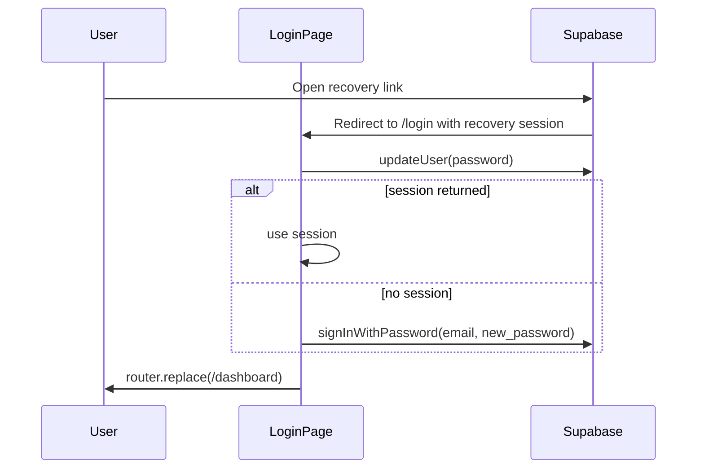

# Password recovery: session + redirect

## Root cause (current code)

- [`PasswordRecoveryUpdatePanel`](src/app/(auth)/login/page.tsx) only calls `supabase.auth.updateUser({ password })`. After a recovery JWT, GoTrue can leave the browser client in a bad or short-lived state; the user then hits **no usable session** when navigating (often reported as “Auth session missing!” from Supabase APIs / RLS).
- The `onAuthStateChange` handler for `USER_UPDATED` sets `suppressPostPasswordUpdateRedirectRef`, clears `passwordResetFlowRef`, and shows the success panel **without** establishing a normal `password` / `otp` session. That matches “success state exists but does not properly establish a new session.”
- `<Auth redirectTo={redirectTo} />` currently builds `redirectTo` from [`getRedirectPath()`](src/app/(auth)/login/page.tsx) which **defaults to `/dashboard`**, not `/login`. For magic links / email redirects, that is the wrong callback target and can contribute to landing on **root** or unexpected routes when Supabase falls back to **Site URL**.

## Implementation plan

### 1. [`src/app/(auth)/login/page.tsx`](src/app/(auth)/login/page.tsx)

**A. Recovery mutation (hook-first, keep `Control<ChangePasswordFormValues>`)**

- In `PasswordRecoveryUpdatePanel`’s `mutationFn`:
  1. Read email **before** update: `const { data: { user } } = await supabase.auth.getUser()`; require `user?.email` (German error via toast if missing).
  2. `const { data, error } = await supabase.auth.updateUser({ password: values.new_password })`; throw on `error`.
  3. If `data.session` is present, rely on the client already having a refreshed session; **else** call `signInWithPassword({ email, password: values.new_password })` and throw on error (covers the “session missing after update” case).
- Keep Zod + `changePasswordSchema` as today (hidden sentinel for `current_password`).

**B. Success UX + redirect**

- On mutation success: show German copy such as **“Passwort erfolgreich aktualisiert. Sie werden weitergeleitet…”** (or close to your wording), then `router.replace("/dashboard")` (use `startTransition` like existing redirects).
- Clear recovery state so middleware and listeners behave like a normal signed-in user: reset `passwordResetFlowRef`, `recoveryPinnedRef`, `suppressPostPasswordUpdateRedirectRef`, and `recoveryPasswordSaved` appropriately (either immediately before redirect or after a very short delay only for readability).
- Remove or narrow the **“Zur Anmeldung”** path for the happy path (optional: keep a discrete error fallback only if sign-in fails).

**C. `onAuthStateChange` alignment**

- Adjust the `USER_UPDATED` branch so it **does not** alone represent “recovery complete” if the panel now performs `signIn` + redirect. Prefer one of:
  - **Option 1 (recommended):** Remove UI side effects from `USER_UPDATED` during recovery; let the mutation drive success + redirect, and let `SIGNED_IN` / `INITIAL_SESSION` handle normal `redirectIfAuthed` when not in recovery.
  - **Option 2:** Keep listener but ensure it never clears the session expectation before `signInWithPassword` finishes (harder to reason about).
- Preserve existing behavior for `PASSWORD_RECOVERY`, JWT `amr` recovery detection, and `redirectTo` query param for **normal** login redirects to `/dashboard`.

**D. `<Auth redirectTo>`**

- Set `redirectTo` to **`${window.location.origin}/login`** (SSR-safe guard: only compute when `typeof window !== "undefined"`; initial render still has `supabase === null` so this is fine). Do **not** use `getRedirectPath()` for the Auth UI prop—that value is for post-login app navigation, not Supabase email/OAuth return URLs.

**E. Small quality**

- Replace `token as string` in `runInitialCheck` with an explicit `typeof token === "string"` guard before `accessTokenIndicatesRecovery` (aligns with “no `!` / avoid loose assertions” spirit).

### 2. [`src/lib/actions/profile.ts`](src/lib/actions/profile.ts)

- **No new insecure server action** (recovery has no server session until after browser auth). Satisfy the “improve if needed” requirement by:
  - Adding a short JSDoc on `updatePasswordAction` distinguishing **authenticated profile password change** vs **recovery on `/login` (browser client)**, **or**
  - If you prefer a named export: add `updatePasswordFromRecovery` as a **documented no-op / not-used** only if you want symmetry—**not recommended**; prefer JSDoc + pointer to login page.

### 3. [`src/lib/utils/auth-recovery-redirect.ts`](src/lib/utils/auth-recovery-redirect.ts) (expanded scope)

- Keep **`resolveAuthRecoveryRedirectUrl`** as the single source for admin-triggered `resetPasswordForEmail` `redirectTo` (already used in [`triggerPasswordReset`](src/lib/services/profile.ts)).
- Add a **production safety net** so `redirect_to` is never accidentally `http://localhost:3000/login` on Vercel when env headers are missing, e.g. when `process.env.VERCEL_ENV === "production"` and higher-priority resolution fails, fall back to `https://aquadock-crm-glqn.vercel.app/login` (your stated canonical URL). Place this **after** `SITE_URL` / `NEXT_PUBLIC_SITE_URL` / forwarded `origin` / `VERCEL_URL` so previews and custom domains still win when configured.

## Verification

- Run `pnpm typecheck && pnpm check:fix` (zero errors).
- Manual flow: admin reset → email link → `/login` recovery form → new password → lands on `/dashboard` signed in; sign out → sign in with new password works.

## Note on AIDER-RULES.md

- The file is **not present** in the repo (only referenced from [`.cursor/rules/architecture.mdc`](.cursor/rules/architecture.mdc)). Implementation will follow the same constraints you listed: hooks-first, `Control<T>`, no non-null assertions, minimal diff.
