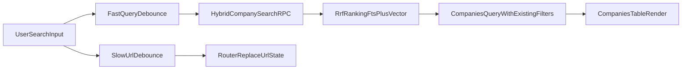

# Semantic Search Implementation Plan

## 1) Analysis

Current search flow is split across three places:
- `globalFilter` is controlled in `[src/components/tables/CompaniesTable.tsx](src/components/tables/CompaniesTable.tsx)` and sent to page state immediately.
- `debouncedGlobalFilter` (300ms) in `[src/app/(protected)/companies/ClientCompaniesPage.tsx](src/app/(protected)/companies/ClientCompaniesPage.tsx)` is used for data fetch + URL/session sync.
- `applyCompaniesListFiltersToCompaniesQuery` in `[src/lib/companies/companies-list-supabase.ts](src/lib/companies/companies-list-supabase.ts)` currently applies exact `ilike` OR matching on `firmenname/strasse/stadt`.

Main lag/jank causes:
- `router.replace(...)` runs whenever debounced filter changes, forcing navigation-state churn during typing.
- `useSuspenseQuery` key changes on each debounced term can re-trigger suspense fallback for uncached terms, which feels like a mini hard refresh.
- Search is lexical-only (`ilike`), so intent-based queries miss relevant records unless exact words overlap.

How semantic hybrid fixes this:
- Hybrid ranking combines keyword precision (`search_vector`) + semantic similarity (`search_embedding`) so users can find by meaning.
- RRF gives robust ranking without dropping existing FTS behavior.
- UX split-debounce (fast query debounce + slower URL-write debounce) preserves URL sync but removes typing stutter.

## 2) Clarifications (resolved)

- Embedding provider path: **Direct xAI embeddings API**.
- Rollout/backfill: **Non-blocking lazy backfill** with fallback.
- Edit scope: **Generated `src/types/supabase.ts` update is allowed**.

Assumption (unless you override after plan approval):
- Always use hybrid path when `globalFilter.trim().length > 0`; empty filter stays existing standard query path.

## 3) Step-by-step Implementation

### A. Database + SQL (new file)
- Create `[src/sql/semantic-company-search.sql](src/sql/semantic-company-search.sql)` with:
  - `CREATE EXTENSION IF NOT EXISTS vector;`
  - Add `companies.search_embedding` vector column.
  - Add HNSW index on `search_embedding`.
  - Add `hybrid_company_search(...)` SQL function implementing:
    - FTS candidate ranking via existing `search_vector`.
    - Vector candidate ranking via cosine distance / inner product.
    - Reciprocal Rank Fusion merge (`1/(k + rank)` style) and deterministic tie-break.
    - Returns ranked `company_id` list (+ optional score for debugging).
- Keep SQL additive and backward compatible (no destructive table rewrites).

### B. Semantic service layer (new file)
- Create `[src/lib/services/semantic-search.ts](src/lib/services/semantic-search.ts)`:
  - `buildCompanyEmbeddingText(...)` from `firmenname, kundentyp, firmentyp, strasse, plz, stadt, land, notes, status, wassertyp`.
  - `createCompanyEmbedding(...)` direct xAI call (`grok-embedding-small`), strict runtime validation for response shape.
  - `searchCompaniesHybrid(...)` wrapper to call Supabase RPC and return ranked ids.
  - Safe fallbacks + small timeout/retry policy (no blocking UI path if embeddings fail).
- Design this service as domain-agnostic primitives so reminders/contacts can reuse later.

### C. Server actions integration (existing file)
- Edit `[src/lib/actions/companies.ts](src/lib/actions/companies.ts)` only where create/update/import happens:
  - On `createCompany`: generate embedding text from validated payload, request embedding, persist `search_embedding` (best effort).
  - On `updateCompany`: if searchable fields changed, regenerate and persist embedding.
  - On `importCompaniesFromCSV`: batch embedding generation for inserted rows (throttled best-effort); do not fail import when embedding API fails.
- Keep server actions thin by calling semantic service helpers.

### D. Query path upgrade while preserving filters/pagination/sorting (existing file)
- Edit `[src/lib/companies/companies-list-supabase.ts](src/lib/companies/companies-list-supabase.ts)`:
  - Keep existing filter behavior intact for `status/kategorie/betriebstyp/land/wassertyp/waterFilter/deleted_at`.
  - Add helper to apply **non-global** filters only (reused by both standard and hybrid paths).
  - Add hybrid global-search helper that:
    - gets ranked ids from semantic service/RPC,
    - constrains main `companies` query to those ids,
    - preserves existing sort + pagination behavior from current page state.
  - If semantic path errors, fallback to current `ilike` behavior automatically.

### E. Client page anti-jank URL sync + data fetch smoothing (existing file)
- Edit `[src/app/(protected)/companies/ClientCompaniesPage.tsx](src/app/(protected)/companies/ClientCompaniesPage.tsx)`:
  - Keep `globalFilter` + existing debounced fetch flow, but split URL persistence debounce (e.g. 800ms) from query debounce.
  - Prevent unnecessary `router.replace` when only transient typing state changes.
  - Keep all existing URL/session restoration logic, row selection, sorting, pagination, and filters unchanged.

### F. Premium search input UX (existing file)
- Edit `[src/components/tables/CompaniesTable.tsx](src/components/tables/CompaniesTable.tsx)` search input only:
  - Add subtle icon + semantic micro-badge / sparkle affordance.
  - Add instant clear button.
  - Add optional tooltip (“AI-powered meaning search”).
  - Update placeholder to: “Search companies by meaning (name, notes, address…)”.
  - Keep same controlled `globalFilter` state contract and pagination reset behavior.

### G. Type safety + verification
- Regenerate types so new column + RPC are typed: update `[src/types/supabase.ts](src/types/supabase.ts)`.
- Run quality gate:
  - `pnpm typecheck`
  - `pnpm check:fix`
- Confirm zero warnings/errors.

## 4) Risks + Zero-Downtime Rollout

- **Embedding API outage/rate-limit**: keep writes non-blocking and fallback to lexical search.
- **Cold-start missing embeddings**: lazy backfill; hybrid RPC excludes null vectors but still includes FTS branch so users keep getting results.
- **Ranking regressions**: tune RRF constants with conservative defaults and deterministic ordering.
- **Performance risk**: HNSW index + limited candidate sets in RPC; preserve current paging/sorting contract.
- **Safety switch**: semantic path can be disabled quickly by returning to existing lexical branch without schema rollback.

Rollout sequence:
1. Deploy additive DB SQL (column/index/RPC).
2. Deploy app with fallback-on-error hybrid logic.
3. Start lazy backfill through create/update/import and opportunistic updates.
4. Monitor latency + result quality; tune RRF weights if needed.

## 5) Reusable Architecture for Other Modules

- Keep provider + embedding utilities in `[src/lib/services/semantic-search.ts](src/lib/services/semantic-search.ts)` as reusable primitives:
  - `buildEmbeddingText(entityType, payload)`
  - `createEmbedding(text)`
  - `hybridSearch({ table, query, filters, limit, offset })`
- Company-specific mapping remains thin adapters, enabling reminders/timeline/contacts adoption with minimal page-level changes.

