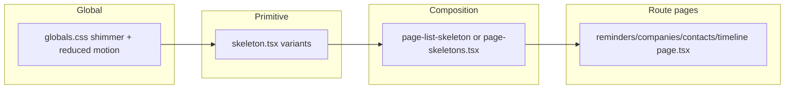

# Skeleton system review and alignment plan

## What the reminders template actually is

[`src/app/(protected)/reminders/page.tsx`](src/app/(protected)/reminders/page.tsx) defines `RemindersPageSkeleton` inline with this structure:

- **Page chrome**: `space-y-8` vertical rhythm.
- **Header**: `flex` column on small screens / row on `sm+`, `border-b` + `pb-6` (no `border-border/80`), breadcrumb/title/subtitle as three `Skeleton` lines, primary action as `h-10` rounded block.
- **KPI strip**: four **plain** blocks — `h-28 rounded-2xl` only (no inner “mini StatCard” layout, no gradient panel wrapper).
- **Filter strip**: `flex flex-wrap gap-2 pb-4`, varied chip widths.
- **Main block**: standard [`Card`](src/components/ui/card.tsx) + [`CardHeader`](src/components/ui/card.tsx) + [`CardContent`](src/components/ui/card.tsx).
- **Rows**: `flex gap-4 rounded-lg border border-border bg-card/50 p-4` — lighter than the “premium” panels in [`page-list-skeleton.tsx`](src/components/ui/page-list-skeleton.tsx).

So the “nice” reminders feel is **flatter KPIs**, **lighter list rows**, and **default Card** — not the `pageSkeletonPanel` gradient + `rounded-2xl` + ring treatment used in [`page-list-skeleton.tsx`](src/components/ui/page-list-skeleton.tsx) (`StatCardSkeleton`, `CompanyListRowSkeleton`, etc.).

[`globals.css`](src/app/globals.css) adds a **global** `::after` shimmer on `[data-slot="skeleton"]`, while [`skeleton.tsx`](src/components/ui/skeleton.tsx) only sets `bg-muted/70` (no `animate-pulse`). All raw `Skeleton` usage inherits the same motion.

## [`SkeletonList.tsx`](src/components/ui/SkeletonList.tsx)

- **Unused** in the repo (only self-references). Either **delete** or **rewire** as a thin helper (e.g. generic vertical list of `Skeleton` lines) once primitives exist — avoid keeping dead client components.

## shadcn `Skeleton` + variants vs separate UI files

**Recommendation (professional split):**

| Layer | Belongs in | Rationale |
|-------|------------|-----------|
| Animation / base surface | **`skeleton.tsx`** via `cva` + `VariantProps` (same pattern as [`button.tsx`](src/components/ui/button.tsx)) | Cross-cutting; matches shadcn style; keeps one primitive. |
| Page / section composition | **One module** (rename or keep [`page-list-skeleton.tsx`](src/components/ui/page-list-skeleton.tsx), optionally `page-skeletons.tsx`) | Layout is not a “variant” of a div — dozens of `Skeleton variant="companies"` would be unmaintainable. |

**Reasonable `Skeleton` variants** (small, shadcn-friendly):

- **`animation`**: `shimmer` (default, current global `::after` behavior), `none` (static block — useful inside already-busy cards or for `prefers-reduced-motion`), optionally `pulse` if you ever want classic pulse without shimmer.
- **`surface`** (optional): `default` vs `inset` / `muted` for slightly different `bg-*` when nested on `bg-card/50` rows (reduces “muddy” double-muted).

Implementation note: today shimmer is **global CSS** on `[data-slot="skeleton"]`. To support `animation="none"` cleanly, either:

- Move shimmer to a **class** (e.g. `data-[skeleton-animate=shimmer]:after:...`) and apply only when variant is shimmer, or  
- Use a **wrapper** `data-skeleton-shimmer` and scope [`globals.css`](src/app/globals.css) to that, so “no animation” skeletons omit the attribute.

**Not recommended:** encoding full pages (`companies`, `timeline`) as `Skeleton` variants — that couples routing/UI to a primitive and explodes API surface.

## Aligning other pages to the reminders template

1. **Extract shared primitives** from the reminders structure into the page-skeleton module (names illustrative):
   - `skeletonPageStack` → `space-y-8`
   - `SkeletonPageHeader` → matches reminders header (props: `actionClassName`)
   - `SkeletonStatStrip` → grid + `rowCount` + `columns` + **`h-28 rounded-2xl`** tiles (reminders style)
   - `SkeletonFilterStrip` → optional, `chipCount` or fixed chip skeletons
   - `SkeletonListCard` → `Card` + header line + children
   - `SkeletonReminderRow` (or generic `SkeletonDenseListRow`) → `rounded-lg border border-border bg-card/50 p-4` + inner flex pattern

2. **Refactor** [`CompaniesPageSkeleton`](src/components/ui/page-list-skeleton.tsx), [`ContactsPageSkeleton`](src/components/ui/page-list-skeleton.tsx), [`TimelinePageSkeleton`](src/components/ui/page-list-skeleton.tsx) to **compose** those primitives so KPI rows and list rows **match reminders** unless a page truly needs a different metaphor (e.g. timeline desktop table can stay a variant **layout** component `TimelineTableSkeleton`, not a `Skeleton` variant).

3. **Move** `RemindersPageSkeleton` out of [`reminders/page.tsx`](src/app/(protected)/reminders/page.tsx) into the same module as the others and export `RemindersPageSkeleton` — single place for Suspense fallbacks, [`reminders/page.tsx`](src/app/(protected)/reminders/page.tsx) only imports it.

4. **Stable React keys**: [`page-list-skeleton.tsx`](src/components/ui/page-list-skeleton.tsx) currently uses array index keys in several maps (Biome `noArrayIndexKey`). Use fixed id slices (as in reminders’ `["reminders-skel-1", ...]`) or a small `const ROW_KEYS = [...] as const` pattern.

## Professional polish (short list)

- **`prefers-reduced-motion`**: in [`globals.css`](src/app/globals.css), disable or simplify `skeleton-shimmer` for users who request reduced motion (WCAG-friendly).
- **Container padding**: reminders use `p-6 sm:p-6 lg:p-8` while companies/contacts/timeline use `p-4 sm:p-6 lg:p-8` — decide one default for “list pages” so skeleton and content swap feel seamless.
- **Optional**: `aria-busy` + `aria-label` on the outer Suspense fallback wrapper for screen readers (low effort, high professionalism).

## File consolidation summary

- **Keep** [`skeleton.tsx`](src/components/ui/skeleton.tsx) as the shadcn-aligned primitive with **limited** variants.
- **Keep** one **composition** file for all page-level skeletons; **remove or reuse** [`SkeletonList.tsx`](src/components/ui/SkeletonList.tsx).
- **Do not** fold page layouts into `Skeleton` variants.
