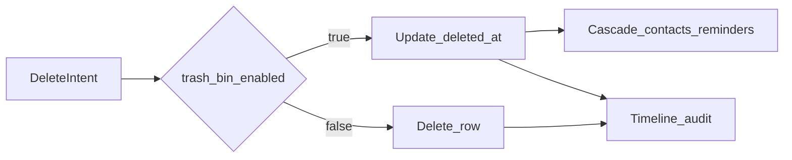

# Soft-delete and Trash Bin (Profile admin only, app-level RLS)

## Scope changes (vs earlier draft)

- **No** [`app/(protected)/trash/page.tsx`](src/app/(protected)/trash/page.tsx) and **no** sidebar / nav link for Trash.
- Trash Bin lives **only** on [`src/app/(protected)/profile/page.tsx`](src/app/(protected)/profile/page.tsx), visible when the user is admin (same gating pattern as [`UserManagementCard`](src/components/features/profile/UserManagementCard.tsx); optionally wrap data load in [`requireAdmin()`](src/lib/auth/require-admin.ts) where a server-only boundary is needed).
- **RLS**: Do **not** enable or modify RLS in this task. **All** visibility rules use PostgREST filters: active data `.is("deleted_at", null)`; trash lists `.not("deleted_at", "is", null)` (or `.not("deleted_at", "is", null)` per Supabase client API — use the project’s established null filter style).
- **Backward compatibility**: `trash_bin_enabled === false` ⇒ hard `DELETE` + audit; no soft row retained (except where FK order requires deleting children first — follow live schema).

---

## 1. Database migration SQL (exact, idempotent)

**Note:** `companies` and `contacts` already expose `deleted_at` in generated types; keep `ADD COLUMN IF NOT EXISTS` so fresh environments stay consistent.

```sql
-- Soft-delete columns (idempotent)
ALTER TABLE public.companies
  ADD COLUMN IF NOT EXISTS deleted_at timestamptz NULL;
ALTER TABLE public.contacts
  ADD COLUMN IF NOT EXISTS deleted_at timestamptz NULL;
ALTER TABLE public.reminders
  ADD COLUMN IF NOT EXISTS deleted_at timestamptz NULL;
ALTER TABLE public.timeline
  ADD COLUMN IF NOT EXISTS deleted_at timestamptz NULL;

-- Composite indexes for scoped active/trash queries
CREATE INDEX IF NOT EXISTS idx_companies_user_id_deleted_at
  ON public.companies (user_id, deleted_at);
CREATE INDEX IF NOT EXISTS idx_contacts_user_id_deleted_at
  ON public.contacts (user_id, deleted_at);
CREATE INDEX IF NOT EXISTS idx_reminders_user_id_deleted_at
  ON public.reminders (user_id, deleted_at);
CREATE INDEX IF NOT EXISTS idx_timeline_user_id_deleted_at
  ON public.timeline (user_id, deleted_at);

-- Partial indexes: rows in trash (deleted_at set)
CREATE INDEX IF NOT EXISTS idx_companies_trashed
  ON public.companies (user_id)
  WHERE deleted_at IS NOT NULL;
CREATE INDEX IF NOT EXISTS idx_contacts_trashed
  ON public.contacts (user_id)
  WHERE deleted_at IS NOT NULL;
CREATE INDEX IF NOT EXISTS idx_reminders_trashed
  ON public.reminders (user_id)
  WHERE deleted_at IS NOT NULL;
CREATE INDEX IF NOT EXISTS idx_timeline_trashed
  ON public.timeline (user_id)
  WHERE deleted_at IS NOT NULL;
```

**RLS note (optional / out of scope):** Leave RLS disabled or unchanged per current project state. Do **not** ship policy changes in [`src/sql/rls-setup.sql`](src/sql/rls-setup.sql) for this feature. Document in [docs/SUPABASE_SCHEMA.md](docs/SUPABASE_SCHEMA.md) that soft-delete enforcement is **application-level** until RLS is tightened later.

After applying: `pnpm supabase:types` → [`src/types/supabase.ts`](src/types/supabase.ts) (and re-exports in [`src/types/database.types.ts`](src/types/database.types.ts) if applicable).

---

## 2. `user_settings`: `trash_bin_enabled` (service layer sketch)

**Key:** `trash_bin_enabled` — `value` is JSON boolean (same pattern as notification prefs).

Add to [`src/lib/services/user-settings.ts`](src/lib/services/user-settings.ts) (minimal additions; reuse existing `jsonToBoolean` / `handleSupabaseError` / `Database` types):

```ts
/** user_settings.key — absent row means trash bin is enabled (default true). */
export const TRASH_BIN_SETTING_KEY = "trash_bin_enabled" as const;

export const TRASH_BIN_DEFAULT_ENABLED = true;

export type TrashBinPreferenceState = {
  trashBinEnabled: boolean;
};

export async function fetchTrashBinPreference(
  client: SupabaseClient<Database>,
  userId: string,
): Promise<TrashBinPreferenceState> {
  const { data, error } = await client
    .from("user_settings")
    .select("value")
    .eq("user_id", userId)
    .eq("key", TRASH_BIN_SETTING_KEY)
    .maybeSingle();

  if (error) throw handleSupabaseError(error, "fetchTrashBinPreference");

  return {
    trashBinEnabled: jsonToBoolean(data?.value, TRASH_BIN_DEFAULT_ENABLED),
  };
}

export async function upsertTrashBinPreference(
  client: SupabaseClient<Database>,
  userId: string,
  state: TrashBinPreferenceState,
): Promise<void> {
  const { error } = await client.from("user_settings").upsert(
    {
      user_id: userId,
      key: TRASH_BIN_SETTING_KEY,
      value: state.trashBinEnabled,
    },
    { onConflict: "user_id,key" },
  );
  if (error) throw handleSupabaseError(error, "upsertTrashBinPreference");
}

/** Validates with Zod then persists (mirror saveNotificationPreferencesFromInput). */
export async function saveTrashBinPreferenceFromInput(
  client: SupabaseClient<Database>,
  userId: string,
  input: unknown,
): Promise<TrashBinPreferenceState> {
  const parsed = trashBinPreferenceSchema.safeParse(input);
  if (!parsed.success) {
    throw new Error("Ungültige Papierkorb-Einstellung");
  }
  await upsertTrashBinPreference(client, userId, parsed.data);
  return parsed.data;
}
```

**Zod** in [`src/lib/validations/settings.ts`](src/lib/validations/settings.ts):

```ts
export const trashBinPreferenceSchema = z
  .object({
    trashBinEnabled: z.boolean(),
  })
  .strict();

export type TrashBinPreference = z.infer<typeof trashBinPreferenceSchema>;
```

**UI toggle:** [`src/app/(protected)/settings/ClientSettingsPage.tsx`](src/app/(protected)/settings/ClientSettingsPage.tsx) — hook-first + early return, load/save via the same patterns as notification preferences (fetch on mount, upsert on change, German strings).

**Server delete path:** small helper (e.g. `src/lib/server/trash-preference.ts`) that uses `createServerSupabaseClient()` + `getUser()` and `fetchTrashBinPreference` so actions stay thin and testable.

---

## 3. Central delete / restore / hard-delete + audit

- **Soft delete** (`trash_bin_enabled`): `UPDATE` `deleted_at = now()`; **company** also updates related **contacts** and **reminders** by `company_id` in the same logical operation (use a single server round-trip with `.update(...).eq("company_id", id)` where RLS allows, or multiple updates — prefer minimal requests).
- **Hard delete** (`!trash_bin_enabled`): `DELETE` rows; respect FK order (children before parent if no `ON DELETE CASCADE`).
- **Restore**: `UPDATE` set `deleted_at = null` (company restore may optionally restore children — **product choice**: match cascade on delete; plan assumes **restore only the entity selected** unless bulk “restore company + dependents” is explicitly implemented; default minimal behavior: restore row(s) selected in trash table).
- **Timeline audit** for: soft delete, hard delete, restore — `activity_type: "other"`, German `title`/`content`, include entity kind + id + human label via `safeDisplay` where names exist. Insert via server Supabase client with `user_id` / `created_by` / `updated_by` set like [`createAuthenticatedTimelineEntry`](src/lib/server/timeline-insert.ts). **Audit rows** are normal timeline rows with `deleted_at` null unless deleted later.

Expose **restore\*** and **hardDelete\*** server actions consumed by Profile Trash UI and by Sonner **Rückgängig**.

---

## 4. Query filtering

- **Every active read** for CRM entities: chain `.is("deleted_at", null)` (companies, contacts, reminders, timeline, joins, map, dashboard, pickers, KPIs, etc.).
- **Trash Bin queries** (Profile admin): `.not("deleted_at", "is", null)` (and scope by `user_id` if the app is multi-tenant per user).

---

## 5. Trash Bin UI (Profile only)

- New **client** component (e.g. `src/components/features/profile/AdminTrashBinCard.tsx`) — shadcn **Tabs** (Companies | Contacts | Reminders | Timeline), each tab = **TanStack Table v8** with row selection, bulk **Restore** and bulk **Hard delete** (confirm destructive dialog).
- Render from [`profile/page.tsx`](src/app/(protected)/profile/page.tsx) **only** for admins (`role === 'admin'`), placed near existing admin chrome (e.g. after `UserManagementCard`).
- If `trash_bin_enabled` is false for the **viewing** admin, show short copy that trash is disabled and hard deletes apply (optional: still allow hard-delete cleanup of legacy rows — product choice; minimal = hide tables and show message).
- Skeletons: stable string keys (e.g. `trash-skeleton-company-${id}` pattern only if id exists; otherwise fixed keys like `trash-skeleton-companies-row` per row **id** from data — never array index as React `key`).
- Columns: `satisfies ColumnDef<RowType>[]` or explicit typing; `safeDisplay` for nullable cells.

---

## 6. Undo (Sonner)

After **successful single-row soft delete**, `toast.success(..., { action: { label: "Rückgängig", onClick: () => void restoreAction(id) } })`. Skip ambiguous bulk undo.

---

## 7. Delivery instructions

### Order of work

1. Run / document **migration SQL** above; regenerate types.
2. Implement **user-settings** + Zod + Settings toggle.
3. Add **server trash preference** helper + **audit insert** helper.
4. Implement **soft/hard delete + restore** in [`companies.ts`](src/lib/actions/companies.ts), [`contacts.ts`](src/lib/actions/contacts.ts), [`reminders.ts`](src/lib/actions/reminders.ts), [`timeline.ts`](src/lib/actions/timeline.ts) (and thin shared helpers if needed).
5. Replace **all delete call sites** and add **active filters** on reads (grep-driven).
6. Add **Profile Trash Bin** component + wire server actions.
7. Add **Undo** toasts on single soft deletes.
8. Update **SUPABASE_SCHEMA.md** changelog; run **`pnpm typecheck && pnpm check:fix`**.

### Files planned to touch (complete list before editing — adjust if grep finds extras)

| Area | Files |
|------|--------|
| SQL / docs | New `src/sql/…` migration snippet optional; [docs/SUPABASE_SCHEMA.md](docs/SUPABASE_SCHEMA.md) |
| Types | [src/types/supabase.ts](src/types/supabase.ts) (generated) |
| Settings | [src/lib/services/user-settings.ts](src/lib/services/user-settings.ts), [src/lib/validations/settings.ts](src/lib/validations/settings.ts), [src/app/(protected)/settings/ClientSettingsPage.tsx](src/app/(protected)/settings/ClientSettingsPage.tsx) |
| Server helpers | New `src/lib/server/trash-preference.ts`, new `src/lib/server/delete-audit.ts` (names flexible) |
| Actions | [src/lib/actions/companies.ts](src/lib/actions/companies.ts), [contacts.ts](src/lib/actions/contacts.ts), [reminders.ts](src/lib/actions/reminders.ts), [timeline.ts](src/lib/actions/timeline.ts); optional [src/lib/actions/trash.ts](src/lib/actions/trash.ts) for bulk profile ops |
| Profile UI | [src/app/(protected)/profile/page.tsx](src/app/(protected)/profile/page.tsx), new `src/components/features/profile/AdminTrashBinCard.tsx` (or similar) |
| Deletes / reads (non-exhaustive — verify with ripgrep) | [ClientCompaniesPage.tsx](src/app/(protected)/companies/ClientCompaniesPage.tsx), [CompanyHeader.tsx](src/components/company-detail/CompanyHeader.tsx), [ClientContactsPage.tsx](src/app/(protected)/contacts/ClientContactsPage.tsx), [ContactDetailClient.tsx](src/app/(protected)/contacts/[id]/ContactDetailClient.tsx), [RemindersCard.tsx](src/components/company-detail/RemindersCard.tsx), [TimelineCard.tsx](src/components/company-detail/TimelineCard.tsx), [TimelineTable.tsx](src/components/tables/TimelineTable.tsx), [ClientTimelinePage.tsx](src/app/(protected)/timeline/ClientTimelinePage.tsx), [OpenMapView.tsx](src/components/features/map/OpenMapView.tsx), [DashboardClient.tsx](src/app/(protected)/dashboard/DashboardClient.tsx), [ReminderCreateForm.tsx](src/components/features/reminder/ReminderCreateForm.tsx) / [Edit](src/components/features/reminder/ReminderEditForm.tsx), contact/company forms, [src/app/api/contacts/[id]/route.ts](src/app/api/contacts/[id]/route.ts), [src/app/api/timeline/[id]/route.ts](src/app/api/timeline/[id]/route.ts), [src/lib/services/timeline.ts](src/lib/services/timeline.ts), [src/lib/services/email.ts](src/lib/services/email.ts) if it reads companies |

### Diffs

- **Minimal, precise** per file; no unrelated refactors; no `!`, `as any`, conditional hooks, or index keys.

### Quality gate

- After all changes: **`pnpm typecheck && pnpm check:fix`** with **zero** errors and **zero** warnings.

---

## 8. Verification

- Soft + hard delete paths; company cascade on soft delete; audit rows for delete/restore; active lists hide `deleted_at` rows; Profile trash shows trashed rows only for admin; Undo restores one row; settings toggle flips behavior.


