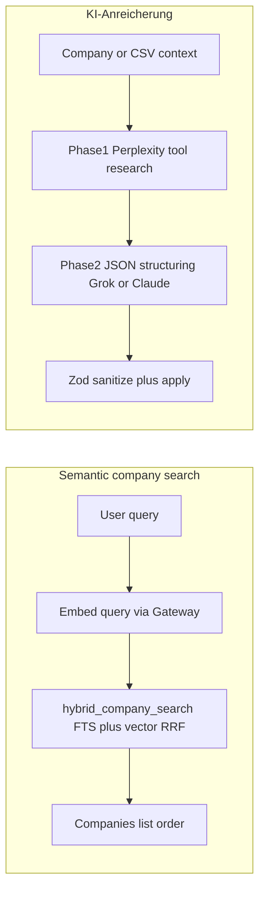

# xAI Semantic Search & KI-Anreicherung – Production Plan v1.0

**Version:** 1.0 (May 2026)  
**Audience:** Maintainers, operators, and implementers (human or agent).  
**Companion docs:** [`AIDER-RULES.md`](AIDER-RULES.md), [`folder-conventions.md`](folder-conventions.md), [`SUPABASE_SCHEMA.md`](SUPABASE_SCHEMA.md), [`architecture.md`](architecture.md), [`german-du-style.md`](german-du-style.md), [`production-deploy.md`](production-deploy.md), [`testing-strategy.md`](testing-strategy.md).  
**External reference:** [xAI Batch API](https://docs.x.ai/developers/advanced-api-usage/batch-api) (async bulk inference; not for interactive modal latency).

**Reading guide:** **Operators** — Implementation Checklist §8 and **Next Action for Operator**. **Developers** — Numbered tasks (§7), SQL (§5), Zod/settings keys (§4). **Copy editors** — §6 German Du examples for every new UI string.

**Tenancy:** Per-user `user_id` on CRM entities and job rows matches [`SUPABASE_SCHEMA.md`](SUPABASE_SCHEMA.md) §1 — **not** multi-tenant workspaces.

---

## 1. Current state (ground truth in repo)

| Surface | Role of xAI today | Key code |
| --- | --- | --- |
| **Semantische Firmensuche** | Optional provider `xai`: `gateway.embeddingModel("xai/grok-embedding-small")`; vectors **1536-d** in `companies.search_embedding`; hybrid merge **FTS + vector** via RPC `hybrid_company_search`. | [`src/lib/services/semantic-search.ts`](../src/lib/services/semantic-search.ts), [`src/sql/semantic-company-search.sql`](../src/sql/semantic-company-search.sql), [`src/lib/companies/companies-list-supabase.ts`](../src/lib/companies/companies-list-supabase.ts) |
| **KI-Anreicherung** | Chat/structuring via Vercel AI SDK + `createGateway`; default fallback structuring model `xai/grok-4.3`; optional **BYOK** `AI_ENRICHMENT_XAI_API_KEY` → `providerOptions.gateway.byok.xai`. | [`src/lib/ai/company-enrichment-gateway.ts`](../src/lib/ai/company-enrichment-gateway.ts), [`src/lib/services/ai-enrichment-policy.ts`](../src/lib/services/ai-enrichment-policy.ts), [`src/lib/actions/company-enrichment.ts`](../src/lib/actions/company-enrichment.ts) |
| **Settings UI** | Semantic: embedding provider/model + toggles — [`src/components/features/settings/ClientSettingsPage.tsx`](../src/components/features/settings/ClientSettingsPage.tsx). Enrichment: structuring model + daily limit — [`src/components/features/settings/AIEnrichmentSettingsCard.tsx`](../src/components/features/settings/AIEnrichmentSettingsCard.tsx). | Env tables — [`docs/production-deploy.md`](production-deploy.md) §1 |

**Critical distinction:** **xAI for search** = **embedding API** (cheap, deterministic-ish vectors stored in Postgres). **xAI for enrichment** = **generative chat + tools** (expensive, validated JSON). Do not merge billing/env documentation — operators configure **`AI_GATEWAY_API_KEY`** globally and optionally **`AI_ENRICHMENT_XAI_API_KEY`** for enrichment-side Grok BYOK only ([`company-enrichment-gateway.ts`](../src/lib/ai/company-enrichment-gateway.ts)).



---

## 2. When to use xAI for which job

| Job | Best xAI surface | Latency expectation | Notes |
| --- | --- | --- | --- |
| **Conceptual company search** (“Hafen mit Restaurant”) | Embeddings (`grok-embedding-small` via gateway **or** OpenAI `text-embedding-3-small`) | \< 15 s embedding timeout ([`EMBEDDINGS_TIMEOUT_MS`](../src/lib/services/semantic-search.ts)) | Hybrid RPC keeps FTS matches even when vector gate rejects noise (`p_max_vector_distance`). |
| **Interactive enrichment** (detail modal, small CSV preview) | Real-time Gateway (`runCompanyEnrichmentGeneration`) | Seconds–few minutes | Phase 1 research model fixed (`google/gemini-3-flash`); user settings drive **phase 2** structuring only ([`company-enrichment-gateway.ts`](../src/lib/ai/company-enrichment-gateway.ts)). |
| **Large bulk / overnight** | **xAI Batch API** (external) + **this plan’s** `ai_batch_jobs` table (see §5) | Up to **~24 h** (provider SLA) | Does **not** replace modal path; for backfills and cost/rate-limit scale ([xAI docs](https://docs.x.ai/developers/advanced-api-usage/batch-api)). |

**Operational rule:** `companies.search_embedding` is **1536** dimensions today. Switching embedding **model or provider** changes the embedding space — treat as a **re-embed migration** (§5.2, Task 3–4), not a silent toggle.

---

## 3. Settings and product flow (refinements to implement)

| Area | Current behavior | Target behavior |
| --- | --- | --- |
| **Billing copy** | Enrichment card shows Vercel credits **or** Grok notice by primary model prefix ([`AIEnrichmentSettingsCard.tsx`](../src/components/features/settings/AIEnrichmentSettingsCard.tsx)). | Add short semantic-search help: gateway key required for `gateway` and `xai` embedding providers; no client exposure of secrets ([`hasProviderCredentials`](../src/lib/services/semantic-search.ts)). |
| **Enrichment vs research** | Structuring model in EAV; Perplexity phase separate. | Help text states explicitly: **“Strukturierungsmodell”** = phase 2 only; **Web-Recherche** = phase 1 (fixed model) — see Task 2. |
| **Hybrid strictness** | `p_max_vector_distance` default **0.5** in RPC; params exist in [`HybridCompanySearchParams`](../src/lib/services/semantic-search.ts) but UI does not expose. | Optional user setting or env-only default: product label **“Streng” / “Weit”** maps to distance band (Task 5). |
| **Re-embed** | None; users can break ranking by switching provider. | Confirm dialog + **Server Action** “re-embed my companies” + **admin** optional full-tenant job (Task 3–4). |

**Environment precedence** (document for operators): `EMBEDDING_PROVIDER` / `EMBEDDING_MODEL` → defaults in [`resolveSemanticSearchSettings`](../src/lib/services/semantic-search.ts); per-user `user_settings` EAV overrides when rows exist — same pattern as enrichment policy ([`ai-enrichment-policy.ts`](../src/lib/services/ai-enrichment-policy.ts)).

---

## 4. `user_settings` keys, Zod, and new keys (planned)

**Existing semantic EAV** (no migration if already present in DB; keys documented in [`semantic-search.ts`](../src/lib/services/semantic-search.ts) and settings UI):

| `user_settings.key` | Type | Purpose |
| --- | --- | --- |
| `embedding_provider` | string | `gateway` \| `openai` \| `xai` (normalized) |
| `embedding_model` | string | e.g. `text-embedding-3-small`, `grok-embedding-small` |
| `semantic_search_enabled` | boolean | Master switch for embeddings + hybrid path |
| `auto_backfill_embeddings` | boolean | Auto-update embedding on company save |
| `show_semantic_badge` | boolean | UI hint on companies table |

**New keys (planned — add to Zod in settings action + constants file under `src/lib/constants/` per [`folder-conventions.md`](folder-conventions.md)):**

| `user_settings.key` | Type | Purpose |
| --- | --- | --- |
| `semantic_match_strictness` | string enum | Maps to `maxVectorDistance` bucket: e.g. `strict` \| `balanced` \| `broad` (implementation maps to numeric RPC param). |
| `embedding_space_version` | string | Opaque tag last successfully applied to user’s embeddings (e.g. hash of `provider:model`); optional optimization for skip logic. |

**Zod:** Extend the settings update schema used by Client Settings (locate `update*` / parse helpers beside [`ClientSettingsPage.tsx`](../src/components/features/settings/ClientSettingsPage.tsx)) with `.strict()`, German-safe error messages, and alignment with [`architecture.md`](architecture.md) validation rules.

**Enrichment keys** (existing — do not rename; document only): see [`src/lib/constants/ai-enrichment-user-settings.ts`](../src/lib/constants/ai-enrichment-user-settings.ts) (`ai_enrichment_primary_model`, Perplexity fast keys, etc.).

---

## 5. SQL and Supabase artifacts

### 5.1 Existing hybrid search

No change required for Phase 1 unless RPC defaults change — source: [`src/sql/semantic-company-search.sql`](../src/sql/semantic-company-search.sql) (`hybrid_company_search`, `vector(1536)`).

### 5.2 Re-embed migration (data-only operator SQL)

**Purpose:** After switching embedding model/provider, optionally clear stale vectors so hybrid search does not mix incompatible spaces (optional **hard** reset — product decision).

```sql
-- Example: scope to current user's companies only (run as privileged role or via controlled admin path).
-- Application prefers batched per-user updates through Server Actions + RLS-scoped client.
UPDATE public.companies
SET search_embedding = NULL
WHERE user_id = '<uuid>'
  AND deleted_at IS NULL;
```

**Regeneration:** Application calls existing [`generateAndStoreCompanyEmbedding`](../src/lib/services/semantic-search.ts) in a throttled loop (service layer), not raw SQL for embeddings.

### 5.3 New table: `ai_batch_jobs` (async xAI Batch + future job kinds)

**Pattern:** Align with **`reminders`** (owned row, `user_id`, status lifecycle) and **`user_notifications`** (server-side inserts for user-visible events; **no** client forge). Naming: `public.ai_batch_jobs`.

| Column | Type | Nullable | Default | Meaning |
| --- | --- | --- | --- | --- |
| id | uuid | no | gen_random_uuid() | PK |
| user_id | uuid | no | — | Owner (`auth.users`); same tenancy as `companies.user_id` |
| job_type | text | no | — | e.g. `xai_batch_enrichment`, `re_embed_companies` |
| status | text | no | `'queued'` | `queued` \| `submitted` \| `processing` \| `completed` \| `failed` \| `cancelled` |
| external_batch_id | text | yes | — | xAI `batch_id` when submitted |
| payload | jsonb | no | `'{}'` | Zod-validated input: filters, company id list cap, options |
| progress | jsonb | yes | — | Mirror provider counters when available (`num_pending`, …) |
| result_summary | jsonb | yes | — | Sanitized summary for UI (counts, not raw model output) |
| error_message | text | yes | — | User-safe German or neutral technical line |
| created_at | timestamptz | no | now() | — |
| updated_at | timestamptz | no | now() | — |

**Indexes:** `(user_id, created_at DESC)`, partial index on `status` where `status IN ('queued','submitted','processing')` for worker polling.

**RLS (recommended pattern):**

- **ENABLE ROW LEVEL SECURITY.**
- **`SELECT`:** `auth.uid() = user_id` (owner sees own jobs).
- **`INSERT`:** `auth.uid() = user_id` (only create jobs for self; **or** restrict INSERT to service role only and force creation via Server Actions — pick one; prefer **insert own row** for simpler debugging).
- **`UPDATE`:** Owner may update **only** `status = 'cancelled'` when job still `queued` | `submitted` (cancellation); all other transitions by **service role** in server worker ([`createAdminClient`](../src/lib/supabase/admin.ts)) — mirrors **user_notifications** “clients don’t forge state.”
- **No `DELETE`** for `authenticated` (optional soft-delete later).

**Worker:** Vercel Cron or internal `fetch` to a **Route Handler** under `src/app/api/` uses **service role** only after authenticating the job row belongs to a legitimate run (verify job id + secret or signed token). Document in [`architecture.md`](architecture.md) *Mutations* section when added.

**Files:** New migration SQL under `supabase/migrations/` (or `src/sql/` one-off per repo convention — follow existing Supabase migration workflow in [`production-deploy.md`](production-deploy.md)); regenerate [`src/types/supabase.ts`](../src/types/supabase.ts) (`pnpm supabase:types`).

**Completion UX:** On terminal status, insert **`user_notifications`** row via [`src/lib/services/in-app-notifications.ts`](../src/lib/services/in-app-notifications.ts) pattern (service role + typed payload in [`src/lib/validations/notification.ts`](../src/lib/validations/notification.ts) — extend with new `type` + strict payload schema).

---

## 6. German Du copy examples (new UI)

Per [`german-du-style.md`](german-du-style.md): capitalize **Du, Dein, …**; professional tone.

| Context | Example copy (DE) |
| --- | --- |
| Embedding provider change warning | **„Du wechselst das Embedding-Modell. Bestehende Vektoren passen dann nicht mehr zur neuen Rechenlogik. Für zuverlässige Treffer solltest Du Deine Firmen neu einbetten.“** |
| Primary button (re-embed own companies) | **„Jetzt neu einbetten“** |
| Secondary (cancel) | **„Später“** |
| Toast (job queued) | **„Die Neu-Einbettung läuft im Hintergrund. Wir informieren Dich, wenn sie fertig ist.“** |
| Toast (batch enrichment submitted) | **„Der Batch-Job wurde gestartet. Das kann einige Stunden dauern.“** |
| Error (missing gateway key) | **„Semantische Suche ist so nicht nutzbar: Der AI-Gateway-Schlüssel fehlt. Bitte teile Deinem Administrator die Einrichtung in der Deployment-Dokumentation mit.“** |
| Enrichment help (phase 1 vs 2) | **„Das Strukturierungsmodell steuert nur die zweite Stufe (JSON aus den Recherche-Ergebnissen). Die Web-Recherche selbst nutzt ein festes Schnellmodell.“** |
| Hybrid strictness | **„Streng: weniger Treffer, dafür näher am Suchbegriff. Weit: mehr Treffer, auch wenn der Bezug lockerer ist.“** |

Add matching **`en.json` / `hr.json`** keys in lockstep; run `pnpm messages:validate` ([`AIDER-RULES.md`](AIDER-RULES.md) §4).

---

## 7. Numbered implementation tasks (concrete)

Each task lists files, schema/SQL, tests, and changelog — **execute in order** unless noted.

### Task 1 — Operator and env documentation

| Item | Detail |
| --- | --- |
| **Files** | [`docs/production-deploy.md`](production-deploy.md) §1 (add row for `EMBEDDING_PROVIDER` / `EMBEDDING_MODEL` if missing); [`docs/SUPABASE_SCHEMA.md`](SUPABASE_SCHEMA.md) §2 (new subsection **ai_batch_jobs** after migration); cross-link this plan. |
| **Zod / keys** | Document only — reference §4 keys. |
| **SQL** | None. |
| **Tests** | None (docs). |
| **Changelog** | Optional **improvement** bullet if operators gain new clarity — [`src/content/changelog.ts`](../src/content/changelog.ts) per [`CHANGELOG_ENTRY_TEMPLATE.md`](CHANGELOG_ENTRY_TEMPLATE.md). |

### Task 2 — Settings help: enrichment phase 1 vs 2

| Item | Detail |
| --- | --- |
| **Files** | [`src/components/features/settings/AIEnrichmentSettingsCard.tsx`](../src/components/features/settings/AIEnrichmentSettingsCard.tsx); [`src/messages/de.json`](../src/messages/de.json), `en.json`, `hr.json`. |
| **Zod / keys** | No new keys; message keys only. |
| **SQL** | None. |
| **Tests** | Vitest snapshot or string key presence optional; **Playwright** smoke only if a visible regression is likely ([`testing-strategy.md`](testing-strategy.md)). |
| **Changelog** | **improvement** — clearer AI settings. |

### Task 3 — Re-embed: warning UX + Server Action

| Item | Detail |
| --- | --- |
| **Files** | [`src/components/features/settings/ClientSettingsPage.tsx`](../src/components/features/settings/ClientSettingsPage.tsx) (confirm on provider/model change); new Server Action module e.g. [`src/lib/actions/semantic-embeddings.ts`](../src/lib/actions/semantic-embeddings.ts) (`"use server"`) calling service in [`src/lib/services/`](../src/lib/services/) (e.g. `semantic-embedding-jobs.ts`). |
| **Zod / keys** | Action input: `z.object({ scope: z.enum(["own_companies"]) }).strict()`; optional `batchSize` bounded. |
| **SQL** | None in action beyond RLS updates; optional NULL reset via Supabase `.update({ search_embedding: null })` per company batch. |
| **Tests** | Vitest: Zod + mocked Supabase for batch loop; **E2E** optional happy path settings → confirm ([`testing-strategy.md`](testing-strategy.md)). |
| **Changelog** | **feature** — Neu-Einbettung nach Modellwechsel. |

### Task 4 — Admin: full-tenant re-embed (optional)

| Item | Detail |
| --- | --- |
| **Files** | [`src/lib/auth/require-admin.ts`](../src/lib/auth/require-admin.ts) consumer; admin route or action under `src/lib/actions/`; UI under `src/components/features/admin/` if exists. |
| **Zod / keys** | Admin-only schema; **no** new `user_settings` keys. |
| **SQL** | Same as §5.2 with admin scope — prefer **service role** + audited log line. |
| **Tests** | Vitest auth guard; E2E only if admin UI ships ([`testing-strategy.md`](testing-strategy.md)). |
| **Changelog** | **improvement** (admin) or omit if internal-only. |

### Task 5 — Hybrid strictness (optional Phase 1b)

| Item | Detail |
| --- | --- |
| **Files** | [`src/lib/services/semantic-search.ts`](../src/lib/services/semantic-search.ts) (map enum → `maxVectorDistance`); [`src/lib/companies/companies-list-supabase.ts`](../src/lib/companies/companies-list-supabase.ts) (pass param); settings persistence in Client Settings; [`src/messages/*.json`](../src/messages/). |
| **Zod / keys** | New key `semantic_match_strictness` §4; enum schema in `src/lib/validations/`. |
| **SQL** | None (RPC already accepts `p_max_vector_distance`). |
| **Tests** | Extend [`companies-list-supabase.test.ts`](../src/lib/companies/companies-list-supabase.test.ts) mock distances; Vitest for mapping function. |
| **Changelog** | **improvement** — feinere semantische Treffer. |

### Task 6 — `ai_batch_jobs` migration + types + RLS

| Item | Detail |
| --- | --- |
| **Files** | `supabase/migrations/<timestamp>_ai_batch_jobs.sql`; optional mirror in `src/sql/` for operators; regenerate [`src/types/supabase.ts`](../src/types/supabase.ts). |
| **Zod / keys** | `src/lib/validations/ai-batch-job.ts` — Insert/Update aligned with generated Row. |
| **SQL** | §5.3 table + RLS policies + indexes. |
| **Tests** | Vitest with mocked Supabase for policy-shaped queries; document manual RLS check per [`SUPABASE_SCHEMA.md`](SUPABASE_SCHEMA.md) §4 Quick verification. |
| **Changelog** | **feature** — Hintergrund-Jobs für KI (user-facing, non-engineering wording per template). |

### Task 7 — xAI Batch worker (Phase 2)

| Item | Detail |
| --- | --- |
| **Files** | `src/app/api/internal/ai-batch/poll/route.ts` (or Cron-targeted handler); [`src/lib/supabase/admin.ts`](../src/lib/supabase/admin.ts); new `src/lib/services/xai-batch-worker.ts` (server-only `fetch` to `api.x.ai`). |
| **Zod / keys** | Validate `payload` jsonb per job_type; reuse [`companyEnrichmentAiSchema`](../src/lib/validations/company-enrichment.ts) on merged results. |
| **SQL** | Updates to `ai_batch_jobs` only. |
| **Tests** | Vitest: mock `fetch` + mock Supabase; coverage comment if worker excluded ([`testing-strategy.md`](testing-strategy.md)). |
| **Changelog** | Same release as Task 6 or follow-up **improvement**. |

### Task 8 — Notification on job completion

| Item | Detail |
| --- | --- |
| **Files** | [`src/lib/services/in-app-notifications.ts`](../src/lib/services/in-app-notifications.ts); extend [`src/lib/validations/notification.ts`](../src/lib/validations/notification.ts) with new `type` + payload. |
| **Zod / keys** | Notification payload strict schema. |
| **SQL** | Inserts into `user_notifications` (existing table — [`SUPABASE_SCHEMA.md`](SUPABASE_SCHEMA.md) **user_notifications**). |
| **Tests** | Vitest [`in-app-notifications.test.ts`](../src/lib/services/in-app-notifications.test.ts) pattern. |
| **Changelog** | **improvement** — Benachrichtigung wenn Batch fertig. |

---

## 8. Implementation Checklist (Phase 1 → Production)

Mirror style: [`production-deploy.md`](production-deploy.md) §2 — staging first, types regenerated, linter clean.

### Phase 1 — Documentation, copy, re-embed UX (no `ai_batch_jobs` yet)

- [ ] **Docs:** Merge Task 1 into `production-deploy.md` and `SUPABASE_SCHEMA.md`; link this file from [`architecture.md`](architecture.md) Testing/Data sections if appropriate.
- [ ] **Copy:** Task 2 + §6 messages; `pnpm messages:validate`.
- [ ] **Re-embed:** Task 3 Server Action + warning UX; throttle + rate respect ([`enrichment-rate-limit.ts`](../src/lib/ai/enrichment-rate-limit.ts) patterns if applicable to embedding CPU).
- [ ] **Quality gate:** `pnpm typecheck && pnpm check:fix` ([`AIDER-RULES.md`](AIDER-RULES.md)); `pnpm test:run` for touched tests.
- [ ] **Changelog:** [`src/content/changelog.ts`](../src/content/changelog.ts) + [`CHANGELOG_ENTRY_TEMPLATE.md`](CHANGELOG_ENTRY_TEMPLATE.md).
- [ ] **Staging smoke:** Settings save, semantic search on companies list, embedding connection indicator ([`testEmbeddingConnectionAction`](../src/lib/actions/semantic-search.ts)).

### Phase 2 — Hybrid strictness (optional)

- [ ] Task 5 implemented; Vitest for mapping + list filter.
- [ ] Staging: vague vs exact queries sanity check.

### Phase 3 — `ai_batch_jobs` + xAI Batch worker

- [ ] Task 6 migration applied on **staging**; `pnpm supabase:types`; RLS verification SQL from [`SUPABASE_SCHEMA.md`](SUPABASE_SCHEMA.md) §4 style.
- [ ] Task 7 worker behind `CRON_SECRET` or Vercel Cron auth.
- [ ] Task 8 notifications.
- [ ] **Production:** deploy in low-traffic window; monitor `ai_batch_jobs` row growth and xAI console batch dashboard.
- [ ] **E2E:** At least one authenticated smoke on notifications bell if new type surfaces ([`testing-strategy.md`](testing-strategy.md)).

### Production gate (always)

- [ ] No secrets in client bundles ([`architecture.md`](architecture.md)).
- [ ] Service role only on server paths documented in PR.
- [ ] Database Linter: no new ERROR-level RLS findings ([`production-deploy.md`](production-deploy.md)).

---

## 9. Risks and constraints (non-exhaustive)

| Risk | Mitigation |
| --- | --- |
| **Embedding dimension ≠ 1536** | Requires **migration** new column + HNSW index — not a settings toggle ([`semantic-company-search.sql`](../src/sql/semantic-company-search.sql)). |
| **Batch latency** | Never wire modal enrichment to xAI Batch; keep gateway synchronous path ([§1 diagram](#1-current-state-ground-truth-in-repo)). |
| **RLS bypass abuse** | Workers use service role **only** in Route Handlers / server; validate job ownership before mutation ([§5.3](#53-new-table-ai_batch_jobs-async-xai-batch--future-job-kinds)). |
| **Cost** | Batch reduces $/token vs real-time per xAI docs; still cap payload sizes and max companies per job in Zod. |

---

## 10. Next Action for Operator

**Today:** Confirm **`AI_GATEWAY_API_KEY`** is set in Vercel (server-only) and documented for the team ([`production-deploy.md`](production-deploy.md) §1). For Grok enrichment billed to xAI, set **`AI_ENRICHMENT_XAI_API_KEY`** and verify in **Settings → KI-Anreicherung** that the Grok billing notice matches your intent ([`AIEnrichmentSettingsCard.tsx`](../src/components/features/settings/AIEnrichmentSettingsCard.tsx)).

**Before enabling aggressive semantic tuning:** Decide whether users may **self-service re-embed** (Task 3) or only admins (Task 4) — product/legal stance on background API cost.

**Before Phase 3:** Apply **`ai_batch_jobs`** migration on **staging**, run **`pnpm supabase:types`**, execute **Quick verification** SQL for RLS as in [`SUPABASE_SCHEMA.md`](SUPABASE_SCHEMA.md) §4, then run **`pnpm e2e`** with `E2E_*` secrets if notification flows changed ([`production-deploy.md`](production-deploy.md) §1).

**Phase 1 Dynamic Model Registry:** `AI_ENRICHMENT_EXTRA_MODELS` env var now supported (see production-deploy.md). Extras are merged at runtime into the registry used by enrichment selects and policy validation. All existing badges, xAI BYOK logic, and `getCompanyResearchBadge` remain unchanged.

---

*End of plan — Phase 1 implemented. Phase 2 (Admin UI + `ai_available_models` table) follows.*
